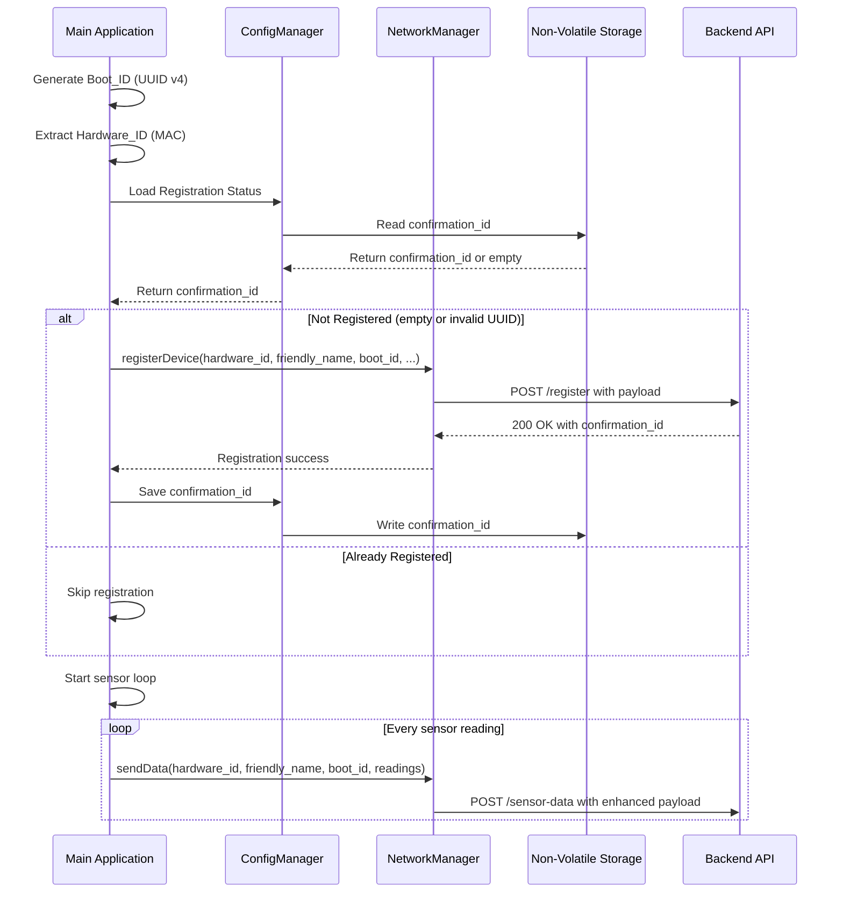
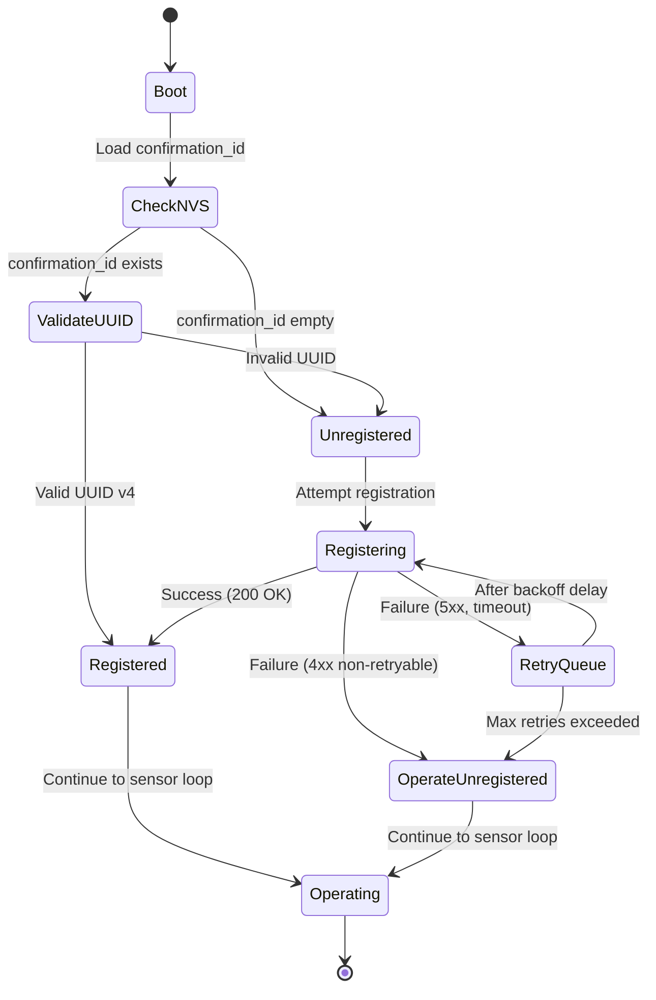

# Design Document: Device Registration

## Overview

This design document describes the device registration flow, persistence model, endpoint derivation, retry behavior, and payload format changes for ESP32 sensor firmware. The system extends the existing NetworkManager and ConfigManager components to support device registration with a backend API using the ESP32's WiFi Station MAC address as an immutable hardware identifier.
gic and exponential backoff
- Enhanced sensor data payloads with hardware ID, friendly name, and boot ID
- Serial console commands for manual registration and hardware ID display

The implementation maintains backward compatibility with existing sensor data transmission while adding new identification fields. Registration failures do not block sensor operation, ensuring graceful degradation.

## Architecture

### Component Overview

The device registration feature integrates with three existing firmware components:

1. **NetworkManager** (`firmware/src/NetworkManager.cpp`)
   - Handles HTTP/HTTPS communication with the backend API
   - Extended with registration-specific methods
   - Manages retry logic with exponential backoff

2. **ConfigManager** (`firmware/src/ConfigManager.cpp`)
   - Manages persistent configuration in NVS
   - Extended to store registration confirmation ID
   - Provides serial console interface for configuration

3. **Main Application** (`firmware/src/main.cpp`)
   - Orchestrates registration flow during startup
   - Generates and maintains Boot_ID in RAM
   - Coordinates between NetworkManager and ConfigManager

### Data Flow



### Registration State Machine



## Components and Interfaces

### 1. Hardware ID Manager

A new utility module for extracting and formatting the ESP32 MAC address.

**Header: `firmware/src/HardwareId.h`**

```cpp
#ifndef HARDWARE_ID_H
#define HARDWARE_ID_H

#include <Arduino.h>

class HardwareId {
public:
    // Get the formatted hardware ID (MAC address as AA:BB:CC:DD:EE:FF)
    static String getHardwareId();

    // Validate that a MAC address is non-zero
    static bool isValidMac(const uint8_t* mac);

private:
    // Format MAC address bytes to colon-separated hex string
    static String formatMac(const uint8_t* mac);
};

#endif
```

**Implementation Details:**
- Uses `esp_read_mac()` with `ESP_MAC_WIFI_STA` to extract WiFi Station MAC
- Validates MAC is not 00:00:00:00:00:00
- Formats as uppercase colon-separated hexadecimal (AA:BB:CC:DD:EE:FF)
- Returns empty string on error

### 2. Boot ID Generator

A utility for generating and storing the session-specific Boot ID.

**Header: `firmware/src/BootId.h`**

```cpp
#ifndef BOOT_ID_H
#define BOOT_ID_H

#include <Arduino.h>

class BootId {
public:
    // Generate a new UUID v4 boot ID
    static String generate();

    // Validate UUID v4 format (8-4-4-4-12 hex characters)
    static bool isValidUuid(const String& uuid);

private:
    // Generate random hex string of specified length
    static String randomHex(int length);
};

#endif
```

**Implementation Details:**
- Generates UUID v4 format: `xxxxxxxx-xxxx-4xxx-yxxx-xxxxxxxxxxxx`
- Uses `esp_random()` for cryptographically secure random values
- Sets version bits (4) and variant bits (8, 9, A, or B) per RFC 4122
- Validation checks format and character set

**Lifecycle Constraint:**
The Boot_ID SHALL be generated exactly once during application startup in `main.cpp` and stored in a global or singleton runtime context. All components MUST reference this value and MUST NOT regenerate it during the same boot session.

### 3. Registration Manager

A new component that handles registration logic and retry state.

**Header: `firmware/src/RegistrationManager.h`**

```cpp
#ifndef REGISTRATION_MANAGER_H
#define REGISTRATION_MANAGER_H

#include <Arduino.h>
#include "NetworkManager.h"
#include "ConfigManager.h"

class RegistrationManager {
public:
    RegistrationManager(NetworkManager* network, ConfigManager* config);

    // Attempt registration (synchronous, with timeout)
    bool registerDevice(const String& hardwareId, const String& bootId,
                       const String& friendlyName, const String& firmwareVersion);

    // Check if device is registered (valid confirmation_id in NVS)
    bool isRegistered();

    // Get stored confirmation ID
    String getConfirmationId();

    // Background retry task (called from main loop or separate FreeRTOS task)
    void processRetries();

private:
    NetworkManager* _network;
    ConfigManager* _config;

    // Retry state
    int _retryCount;
    unsigned long _nextRetryTime;
    bool _retryPending;

    // Cached registration payload for retries
    String _cachedRegistrationPayload;

    // Calculate next retry delay with exponential backoff and jitter
    unsigned long calculateBackoff(int attempt);

    // Validate confirmation ID format (UUID v4)
    bool isValidConfirmationId(const String& confirmationId);

    // Queue a retry attempt
    void queueRetry();
};

#endif
```

**Implementation Details:**
- Manages registration state and retry logic
- Implements exponential backoff: 1s, 2s, 4s, 8s, 16s with 0-500ms jitter, clamped to 30 seconds maximum
- Maximum 5 retry attempts
- Caches the full registration payload for background retries to ensure deterministic backend logs
- Validates confirmation_id as UUID v4 before storing

**Non-Blocking Execution Requirement:**
`registerDevice()` SHALL NOT be called in a way that blocks the main loop. It MUST either run in a FreeRTOS task or be invoked only from `processRetries()` with time-sliced execution (yielding between operations). The recommended approach is to always run registration attempts in a dedicated FreeRTOS task to guarantee sensor timing is unaffected.

### 4. NetworkManager Extensions

Extend the existing NetworkManager with registration methods.

**New Methods in `firmware/src/NetworkManager.h`:**

```cpp
class NetworkManager {
public:
    // Existing methods...
    bool sendData(const String& payload);

    // New registration method
    bool registerDevice(const String& payload, String& confirmationId);

    // Derive registration endpoint from configured API endpoint
    String getRegistrationEndpoint();

private:
    // Existing members...
    String _apiEndpoint;
    String _apiKey;

    // Parse HTTP response and extract confirmation_id
    bool parseRegistrationResponse(const String& response, String& confirmationId);

    // Replace last path segment with "register"
    String deriveEndpoint(const String& dataEndpoint);
};
```

**Implementation Details:**
- `registerDevice()` sends POST to registration endpoint with 10-second timeout
- Returns HTTP status code and extracts `confirmation_id` from JSON response
- `getRegistrationEndpoint()` derives endpoint by replacing last path segment
- Uses same authentication (X-API-Key header) as sensor data
- Reuses existing HTTP/HTTPS client infrastructure

### 5. ConfigManager Extensions

Extend ConfigManager to store registration confirmation ID.

**New Methods in `firmware/src/ConfigManager.h`:**

```cpp
class ConfigManager {
public:
    // Existing methods...
    String getDeviceId();  // Now used for friendly_name
    String getApiEndpoint();
    String getApiKey();

    // New registration methods
    String getConfirmationId();
    void setConfirmationId(const String& confirmationId);
    bool hasValidConfirmationId();

private:
    // NVS key for confirmation ID (namespaced to prevent collisions)
    static const char* NVS_KEY_CONFIRMATION_ID = "dev.confirm_id";
};
```

**Implementation Details:**
- Stores `confirmation_id` in NVS with key "dev.confirm_id" (namespaced to prevent collisions)
- `hasValidConfirmationId()` validates UUID v4 format with strict version and variant checks
- UUID v4 validation SHALL enforce: 3rd group first nibble is 4, 4th group first nibble is one of 8|9|A|B
- Returns empty string if not set or invalid

### 6. Serial Console Extensions

Add new commands to the existing serial console interface.

**New Commands:**

```
register    - Manually trigger device registration
hwid        - Display hardware ID (MAC address)
bootid      - Display current boot ID
```

**Implementation in `firmware/src/ConfigManager.cpp`:**

```cpp
void ConfigManager::handleSerialCommand(const String& command) {
    // Existing commands...

    if (command == "register") {
        // Trigger manual registration
        Serial.println("Triggering manual registration...");
        // Call registration manager via callback provided by main.cpp
    }
    else if (command == "hwid") {
        Serial.print("Hardware ID: ");
        Serial.println(HardwareId::getHardwareId());
    }
    else if (command == "bootid") {
        Serial.print("Boot ID: ");
        Serial.println(g_bootId);  // Global variable in main.cpp
    }
}
```

**Integration Note:**
`main.cpp` SHALL own RegistrationManager and provide a callback/hook to ConfigManager for commands that require cross-component actions (e.g., `register`). This prevents tight coupling and avoids global variables.

## Data Models

### Registration Request Payload

```json
{
  "hardware_id": "AA:BB:CC:DD:EE:FF",
  "friendly_name": "greenhouse-sensor-01",
  "boot_id": "550e8400-e29b-41d4-a716-446655440000",
  "firmware_version": "1.0.0",
  "capabilities": {
    "sensors": ["bme280", "ds18b20", "soil_moisture"],
    "features": {
      "tft_display": true,
      "offline_buffering": true,
      "ntp_sync": true
    }
  }
}
```

**Field Specifications:**
- `hardware_id` (required): WiFi Station MAC address, uppercase, colon-separated
- `friendly_name` (optional): User-configured name, max 64 characters, omitted if not set
- `boot_id` (required): UUID v4 generated on boot, stored in RAM only
- `firmware_version` (required): Semantic version string (e.g., "1.0.0")
- `capabilities.sensors` (required): Array of sensor type strings
- `capabilities.features` (required): Object with boolean flags for each feature

### Registration Response Payload

**Success (New Registration):**
```json
{
  "status": "registered",
  "confirmation_id": "7c9e6679-7425-40de-944b-e07fc1f90ae7",
  "hardware_id": "AA:BB:CC:DD:EE:FF",
  "registered_at": "2024-01-15T10:30:00Z"
}
```

**Success (Already Registered):**
```json
{
  "status": "already_registered",
  "confirmation_id": "7c9e6679-7425-40de-944b-e07fc1f90ae7",
  "hardware_id": "AA:BB:CC:DD:EE:FF",
  "first_registered_at": "2024-01-10T08:00:00Z"
}
```

**Error Response:**
```json
{
  "error": "invalid_payload",
  "message": "Missing required field: hardware_id"
}
```

**Field Specifications:**
- `confirmation_id` (required in success): UUID v4 format, stored in NVS
- `status` (required): "registered" or "already_registered"
- `hardware_id` (required): Echo of submitted hardware_id
- `registered_at` / `first_registered_at` (optional): ISO 8601 timestamp

### Enhanced Sensor Data Payload

```json
{
  "hardware_id": "AA:BB:CC:DD:EE:FF",
  "friendly_name": "greenhouse-sensor-01",
  "boot_id": "550e8400-e29b-41d4-a716-446655440000",
  "readings": [
    {
      "sensor": "bme280",
      "temperature": 22.5,
      "humidity": 65.0,
      "pressure": 1013.25,
      "timestamp": "2024-01-15T10:35:00Z"
    }
  ]
}
```

**New Fields:**
- `hardware_id` (required): Always included in every sensor data transmission
- `friendly_name` (optional): Included if configured, omitted otherwise
- `boot_id` (required): Current session identifier, changes on reboot

**Backward Compatibility:**
- Existing `readings` array structure unchanged
- New fields added at root level
- Backend can ignore new fields if not needed

## Endpoint Derivation Algorithm

The registration endpoint is derived from the configured sensor data endpoint by replacing the last path segment with "register".

**Safety Rules:**
- Strip trailing slashes from the endpoint before processing
- Remove both query string and URL fragment by cutting at the earliest occurrence of `?` or `#`
- Guarantee exactly one slash between domain and /register

**Algorithm:**

```cpp
String NetworkManager::deriveEndpoint(const String& dataEndpoint) {
    String endpoint = dataEndpoint;

    // Strip trailing slashes
    while (endpoint.endsWith("/")) {
        endpoint = endpoint.substring(0, endpoint.length() - 1);
    }

    // Remove query string and fragment at earliest occurrence
    int queryPos = endpoint.indexOf('?');
    int fragmentPos = endpoint.indexOf('#');
    int cutPos = -1;

    if (queryPos != -1 && fragmentPos != -1) {
        cutPos = min(queryPos, fragmentPos);
    } else if (queryPos != -1) {
        cutPos = queryPos;
    } else if (fragmentPos != -1) {
        cutPos = fragmentPos;
    }

    if (cutPos != -1) {
        endpoint = endpoint.substring(0, cutPos);
    }

    // Find the last '/' in the path
    int lastSlash = endpoint.lastIndexOf('/');

    if (lastSlash == -1) {
        // No path, append /register
        return endpoint + "/register";
    }

    // Check if last slash is part of protocol (http://)
    if (lastSlash < 8) {
        // No path after domain, append /register
        return endpoint + "/register";
    }

    // Replace last segment with "register"
    return endpoint.substring(0, lastSlash + 1) + "register";
}
```

**Examples:**
- `https://api.example.com/v1/sensor-data` → `https://api.example.com/v1/register`
- `https://api.example.com/sensor-data` → `https://api.example.com/register`
- `http://192.168.1.100:8080/api/v2/data` → `http://192.168.1.100:8080/api/v2/register`
- `https://api.example.com` → `https://api.example.com/register`
- `https://api.example.com/data/` → `https://api.example.com/register` (trailing slash stripped)
- `https://api.example.com/data?key=value` → `https://api.example.com/register` (query string ignored)

## Retry Logic and Exponential Backoff

### Retry Decision Matrix

| HTTP Status | Action | Retry |
|-------------|--------|-------|
| 200 OK | Store confirmation_id | No |
| 201 Created | Store confirmation_id | No |
| 400 Bad Request | Log error | No |
| 401 Unauthorized | Log error | No |
| 403 Forbidden | Log error | No |
| 404 Not Found | Log error | No |
| 408 Request Timeout | Queue retry | Yes (max 5) |
| 429 Too Many Requests | Queue retry | Yes (max 5) |
| 500 Internal Server Error | Queue retry | Yes (max 5) |
| 502 Bad Gateway | Queue retry | Yes (max 5) |
| 503 Service Unavailable | Queue retry | Yes (max 5) |
| 504 Gateway Timeout | Queue retry | Yes (max 5) |
| Network timeout | Queue retry | Yes (max 5) |
| Connection refused | Queue retry | Yes (max 5) |

### Backoff Calculation

```cpp
unsigned long RegistrationManager::calculateBackoff(int attemptIndex) {
    // Base delay: 1 second
    unsigned long baseDelay = 1000;

    // Exponential: 2^attemptIndex seconds
    // attemptIndex is zero-based: 0→1s, 1→2s, 2→4s, 3→8s, 4→16s
    unsigned long delay = baseDelay * (1 << attemptIndex);

    // Clamp to maximum 30 seconds to prevent overflow
    if (delay > 30000) {
        delay = 30000;
    }

    // Add random jitter: 0-500ms
    unsigned long jitter = esp_random() % 501;

    return delay + jitter;
}
```

**Retry Schedule (attemptIndex is zero-based):**
- attemptIndex 0: 1000-1500ms
- attemptIndex 1: 2000-2500ms
- attemptIndex 2: 4000-4500ms
- attemptIndex 3: 8000-8500ms
- attemptIndex 4: 16000-16500ms
- After 5 attempts: Give up, operate unregistered

**Note:** The backoff delay is clamped to a maximum of 30,000 milliseconds to prevent integer overflow or excessively long retry intervals.

### Background Retry Implementation

Registration retries occur in the background without blocking sensor data transmission. The main loop SHALL invoke `RegistrationManager.processRetries()` on every iteration or via a dedicated FreeRTOS task to ensure non-blocking retry behavior.

**Option 1: Main Loop Integration (Simpler)**

```cpp
void loop() {
    // Process background registration retries
    registrationManager.processRetries();

    // Continue with sensor readings
    readSensors();
    sendSensorData();

    delay(sensorInterval);
}
```

**Option 2: Separate FreeRTOS Task (More Robust)**

```cpp
void registrationRetryTask(void* parameter) {
    RegistrationManager* regMgr = (RegistrationManager*)parameter;

    while (true) {
        regMgr->processRetries();
        vTaskDelay(pdMS_TO_TICKS(100));  // Check every 100ms
    }
}

void setup() {
    // ... initialization ...

    // Create retry task with low priority
    xTaskCreate(
        registrationRetryTask,
        "RegRetry",
        4096,  // Stack size
        &registrationManager,
        1,     // Low priority
        NULL
    );
}
```

**Recommendation:** Start with Option 1 (main loop) for simplicity. Migrate to Option 2 if registration retries interfere with sensor timing.

## Error Handling

### Error Categories

1. **Configuration Errors**
   - Missing API endpoint
   - Missing API key
   - Invalid MAC address (00:00:00:00:00:00)
   - Action: Log error, operate unregistered

2. **Network Errors**
   - WiFi disconnected
   - DNS resolution failure
   - Connection timeout
   - Action: Queue retry with backoff

3. **HTTP Client Errors (4xx)**
   - 400 Bad Request: Invalid payload format
   - 401 Unauthorized: Invalid API key
   - 403 Forbidden: Access denied
   - 404 Not Found: Endpoint doesn't exist
   - Action: Log error, do not retry

4. **HTTP Server Errors (5xx)**
   - 500 Internal Server Error
   - 502 Bad Gateway
   - 503 Service Unavailable
   - 504 Gateway Timeout
   - Action: Queue retry with backoff

5. **Response Parsing Errors**
   - Malformed JSON
   - Missing confirmation_id field
   - Invalid confirmation_id format (not UUID v4)
   - Action: Log error, treat as failure
   - **Important:** If HTTP status is retryable (408/429/5xx), the device SHALL retry even if the body is non-JSON or cannot be parsed. This handles common cases like 503 responses with HTML error pages.

### Logging Strategy

```cpp
// Error levels (for development only)
#define LOG_ERROR(msg)   Serial.println("[ERROR] " + String(msg))
#define LOG_WARN(msg)    Serial.println("[WARN] " + String(msg))
#define LOG_INFO(msg)    Serial.println("[INFO] " + String(msg))
#define LOG_DEBUG(msg)   Serial.println("[DEBUG] " + String(msg))

// Example usage
if (!isValidMac(mac)) {
    LOG_ERROR("Invalid MAC address: 00:00:00:00:00:00");
    return false;
}

if (httpCode == 401) {
    LOG_ERROR("Registration failed: Unauthorized (check API key)");
    return false;
}

if (httpCode >= 500) {
    LOG_WARN("Registration failed: Server error " + String(httpCode) + ", will retry");
    queueRetry();
}
```

**Important:** The LOG_* macros are for development only; production paths SHOULD use `Serial.printf()` to avoid heap churn.

**Heap Safety Note:**
Logging SHOULD avoid dynamic String concatenation and prefer `Serial.printf()` or fixed buffers to reduce heap fragmentation on ESP32. For production code, consider:

```cpp
// Preferred approach to avoid heap fragmentation
Serial.printf("[ERROR] Registration failed: Server error %d, will retry\n", httpCode);
```

### Graceful Degradation

The device continues normal operation even when registration fails:

1. **Sensor readings continue** regardless of registration status
2. **Data transmission continues** with enhanced payload (hardware_id, boot_id, optional friendly_name)
3. **Background retries** attempt registration without blocking main loop
4. **Serial console** allows manual registration trigger
5. **Status indicators** (if TFT display present) show registration state

## Testing Strategy

The testing strategy employs both unit tests and property-based tests to ensure comprehensive coverage of the device registration functionality.

### Unit Testing

Unit tests validate specific examples, edge cases, and error conditions using the Arduino testing framework or PlatformIO's Unity test framework.

**Test Categories:**

1. **Hardware ID Extraction**
   - Valid MAC address formatting
   - Zero MAC address rejection
   - Cross-platform compatibility (ESP32, ESP32-S2, ESP32-S3, ESP32-C3)

2. **Boot ID Generation**
   - UUID v4 format validation
   - Uniqueness across multiple generations
   - Non-persistence verification

3. **Endpoint Derivation**
   - Various URL formats (with/without paths, ports, protocols)
   - Edge cases (no path, root path, multiple segments)

4. **Confirmation ID Validation**
   - Valid UUID v4 acceptance
   - Invalid format rejection
   - Empty string handling

5. **Retry Logic**
   - Backoff calculation correctness
   - Jitter range validation
   - Max retry limit enforcement

6. **HTTP Response Parsing**
   - Valid JSON with confirmation_id
   - Malformed JSON handling
   - Missing fields handling

### Property-Based Testing

Property-based tests verify universal properties across many generated inputs using a property testing library. For C++/Arduino, we'll use a lightweight property testing approach with randomized inputs.

**Configuration:**
- Minimum 100 iterations per property test
- Each test tagged with feature name and property number
- Tests reference design document properties

**Property Testing Library:**
For ESP32/Arduino C++, we'll implement a simple property testing framework or use manual randomized testing with Unity assertions, as mature PBT libraries are limited in the embedded space.

**Execution Environment:**
Property-based tests SHALL primarily run in host or emulator environments. On-device execution SHOULD limit iteration counts to avoid watchdog timeouts and excessive CPU usage. For on-device testing, consider reducing iterations from 100 to 10-20.

**Example Property Test Structure:**

```cpp
// Feature: device-registration, Property 1: MAC formatting consistency
void test_property_mac_formatting() {
    for (int i = 0; i < 100; i++) {
        // Generate random MAC address
        uint8_t mac[6];
        for (int j = 0; j < 6; j++) {
            mac[j] = random(0, 256);
        }

        // Format MAC
        String formatted = HardwareId::formatMac(mac);

        // Property: Formatted MAC should always be 17 characters
        TEST_ASSERT_EQUAL(17, formatted.length());

        // Property: Should contain exactly 5 colons
        int colonCount = 0;
        for (char c : formatted) {
            if (c == ':') colonCount++;
        }
        TEST_ASSERT_EQUAL(5, colonCount);
    }
}
```

### Integration Testing

Integration tests verify end-to-end flows:

1. **Registration Flow**
   - Boot → Check NVS → Register → Store confirmation_id
   - Boot → Check NVS → Already registered → Skip registration

2. **Retry Flow**
   - Registration failure → Queue retry → Backoff → Retry → Success

3. **Sensor Data Enhancement**
   - Sensor reading → Add hardware_id, boot_id, friendly_name → Send

4. **Serial Console**
   - `register` command → Trigger registration
   - `hwid` command → Display hardware ID
   - `bootid` command → Display boot ID

### Mock Backend

For testing without a real backend, implement a mock HTTP server:

```cpp
class MockBackend {
public:
    void setResponse(int httpCode, const String& body);
    void simulateTimeout();
    void simulateNetworkError();

    // Capture last request for verification
    String getLastPayload();
    String getLastEndpoint();
};
```

This allows testing various backend responses and error conditions in a controlled environment.

## Correctness Properties

A property is a characteristic or behavior that should hold true across all valid executions of a system—essentially, a formal statement about what the system should do. Properties serve as the bridge between human-readable specifications and machine-verifiable correctness guarantees.

The following properties define the correctness criteria for the device registration feature. Each property is universally quantified and references the specific requirements it validates.

### Property 1: MAC Address Formatting Consistency

*For any* 6-byte MAC address array, when formatted by the HardwareId module, the resulting string should be exactly 17 characters long, contain exactly 5 colons at positions 2, 5, 8, 11, and 14, and contain only uppercase hexadecimal characters (0-9, A-F) and colons.

**Validates: Requirements 1.2**

### Property 2: Hardware ID Consistency Across API Calls

*For any* sequence of API calls (registration and sensor data) within a single boot session, all payloads should contain the same hardware_id value.

**Validates: Requirements 1.3**

### Property 3: Invalid UUID Triggers Registration

*For any* string that does not match the UUID v4 format (8-4-4-4-12 hexadecimal characters with hyphens), when stored as Registration_Status in NVS, the device should treat it as empty and attempt registration on next boot.

**Validates: Requirements 2.3, 6.3**

### Property 4: NVS Persistence Round-Trip

*For any* valid UUID v4 string (confirmation_id or friendly_name), when written to NVS and then read back, the retrieved value should exactly match the original value.

**Validates: Requirements 2.4, 6.1**

### Property 5: Registration Payload Structure Completeness

*For any* registration request, the JSON payload should contain all required fields (hardware_id, boot_id, firmware_version, capabilities) with correct types, and the capabilities object should have both "sensors" array and "features" object with boolean values.

**Validates: Requirements 3.1, 3.4, 3.5, 3.9, 3.10**

### Property 6: Conditional Friendly Name Inclusion in Registration

*For any* registration request where a friendly_name is configured, the payload should include the "friendly_name" field with the configured value.

**Validates: Requirements 3.2**

### Property 7: Boot ID Format Compliance

*For any* generated Boot_ID, it should match the UUID v4 format: 8-4-4-4-12 hexadecimal characters separated by hyphens, with the version bits set to 4 in the third group and variant bits set to 8, 9, A, or B in the fourth group.

**Validates: Requirements 3.6**

### Property 8: Endpoint Derivation Preserves URL Components

*For any* valid HTTP/HTTPS URL with at least one path segment, when deriving the registration endpoint, the protocol, domain, port, and all path segments except the last should be preserved, and the last segment should be replaced with "register".

**Validates: Requirements 4.1, 4.4**

### Property 9: API Key Header Inclusion

*For any* registration or sensor data request, the HTTP headers should include an "X-API-Key" header with the configured API key value.

**Validates: Requirements 5.1, 5.2**

### Property 10: Friendly Name Configuration Propagation

*For any* friendly_name value stored in NVS, when retrieved and used in API payloads, the value should match exactly what was stored.

**Validates: Requirements 9.3**

### Property 11: Exponential Backoff Calculation

*For any* retry attemptIndex n (where 0 ≤ n ≤ 4), the calculated backoff delay should be (1000 * 2^n) milliseconds plus jitter, where jitter is in the range [0, 500] milliseconds, and the total delay is clamped to a maximum of 30,000 milliseconds.

**Validates: Requirements 10.6, 10.7**

### Property 12: HTTP Status Code Retry Decision

*For any* HTTP status code, the retry decision should follow this mapping:
- 408, 429, 5xx (500-599): retry with backoff
- All other 4xx (400-499): no retry
- 2xx (200-299): no retry (success)

**Validates: Requirements 10.4, 10.8, 12.3, 12.5**

### Property 13: Sensor Data Payload Structure Completeness

*For any* sensor data transmission, the JSON payload should always include hardware_id and boot_id fields, and should include friendly_name field if and only if a friendly_name is configured.

**Validates: Requirements 11.1, 11.2, 11.4**

### Property 14: Boot ID Session Consistency

*For any* sequence of sensor data transmissions within a single boot session (before reboot), all payloads should contain the same boot_id value.

**Validates: Requirements 11.4**

### Example-Based Test Cases

The following test cases validate specific scenarios and edge cases:

**Test Case 1: Empty Registration Status Triggers Registration**
- Given: NVS contains empty string for confirmation_id
- When: Device boots and checks registration status
- Then: Device should attempt registration
- **Validates: Requirements 2.2**

**Test Case 2: Valid UUID Prevents Re-registration**
- Given: NVS contains valid UUID v4 confirmation_id
- When: Device boots and checks registration status
- Then: Device should skip registration attempt
- **Validates: Requirements 2.5**

**Test Case 3: Registration Failure Allows Sensor Operation**
- Given: Registration attempt fails with network error
- When: Device continues to main loop
- Then: Sensor readings and data transmission should proceed normally
- **Validates: Requirements 2.7, 10.2, 10.3**

**Test Case 4: Friendly Name Omission When Not Configured**
- Given: No friendly_name configured in NVS
- When: Building registration payload
- Then: Payload should not contain "friendly_name" field
- **Validates: Requirements 3.3**

**Test Case 5: Boot ID Not Persisted to NVS**
- Given: Boot_ID generated on boot
- When: Checking NVS contents
- Then: NVS should not contain any boot_id key or value
- **Validates: Requirements 3.8**

**Test Case 6: Endpoint Derivation Example 1**
- Given: API endpoint "https://api.example.com/v1/sensor-data"
- When: Deriving registration endpoint
- Then: Result should be "https://api.example.com/v1/register"
- **Validates: Requirements 4.2**

**Test Case 7: Endpoint Derivation Example 2**
- Given: API endpoint "https://api.example.com/sensor-data"
- When: Deriving registration endpoint
- Then: Result should be "https://api.example.com/register"
- **Validates: Requirements 4.3**

**Test Case 8: NVS Corruption Triggers Registration**
- Given: NVS is erased or returns error when reading confirmation_id
- When: Device boots and checks registration status
- Then: Device should treat status as empty and attempt registration
- **Validates: Requirements 6.5**

**Test Case 9: Manual Registration Command**
- Given: Device already registered with valid confirmation_id in NVS
- When: User executes "register" command via serial console
- Then: Device should attempt registration regardless of current status
- **Validates: Requirements 7.2**

**Test Case 10: Manual Registration Updates NVS**
- Given: User executes "register" command
- When: Registration succeeds with new confirmation_id
- Then: NVS should be updated with the new confirmation_id
- **Validates: Requirements 7.3**

**Test Case 11: Friendly Name Length Boundary**
- Given: Friendly name string of exactly 64 characters
- When: Storing to NVS and using in payloads
- Then: Full 64-character string should be preserved
- **Edge Case - Validates: Requirements 9.4**

**Test Case 12: Max Retry Limit Enforcement**
- Given: Registration fails 5 times with retryable errors
- When: 5th retry fails
- Then: Device should stop retrying and operate unregistered
- **Validates: Requirements 10.5**

**Test Case 13: HTTP 408 Triggers Retry**
- Given: Backend returns HTTP 408 Request Timeout
- When: Processing response
- Then: Device should queue retry with exponential backoff
- **Validates: Requirements 10.9**

**Test Case 14: Sensor Data Without Friendly Name**
- Given: No friendly_name configured
- When: Building sensor data payload
- Then: Payload should not contain "friendly_name" field
- **Validates: Requirements 11.3**

**Test Case 15: Backward Compatibility Verification**
- Given: Existing sensor data format with "readings" array
- When: Adding new fields (hardware_id, boot_id, friendly_name)
- Then: "readings" array structure should remain unchanged
- **Validates: Requirements 11.5**

**Test Case 16: Successful Registration Response Handling**
- Given: Backend returns HTTP 200 with valid confirmation_id
- When: Parsing response
- Then: Device should extract confirmation_id and store in NVS
- **Validates: Requirements 12.1**

**Test Case 17: Already Registered Response Handling**
- Given: Backend returns HTTP 200 with status "already_registered" and confirmation_id
- When: Parsing response
- Then: Device should store the confirmation_id in NVS
- **Validates: Requirements 12.2**

**Test Case 18: HTTP 429 Triggers Retry**
- Given: Backend returns HTTP 429 Too Many Requests
- When: Processing response
- Then: Device should retry with exponential backoff up to 5 attempts
- **Validates: Requirements 12.4**

**Test Case 19: Malformed JSON Response Handling**
- Given: Backend returns HTTP 200 with invalid JSON
- When: Parsing response
- Then: Device should log error and treat as failure without retry
- **Validates: Requirements 12.6**

**Test Case 20: Missing Confirmation ID Response Handling**
- Given: Backend returns HTTP 200 with valid JSON but no confirmation_id field
- When: Parsing response
- Then: Device should log error and treat as failure without retry
- **Validates: Requirements 12.7**

**Test Case 21: Invalid Confirmation ID Format Response Handling**
- Given: Backend returns HTTP 200 with confirmation_id that is not valid UUID v4
- When: Parsing response
- Then: Device should log error and treat as failure without retry
- **Validates: Requirements 12.8**

**Test Case 22: HTTP Client Timeout Configuration**
- Given: Configuring HTTP client for registration
- When: Setting timeout value
- Then: Timeout should be set to maximum 10 seconds
- **Validates: Requirements 13.2**

**Test Case 23: Zero MAC Address Rejection**
- Given: MAC address extracted as 00:00:00:00:00:00
- When: Validating MAC address
- Then: Validation should fail and device should log error
- **Validates: Requirements 14.4**
