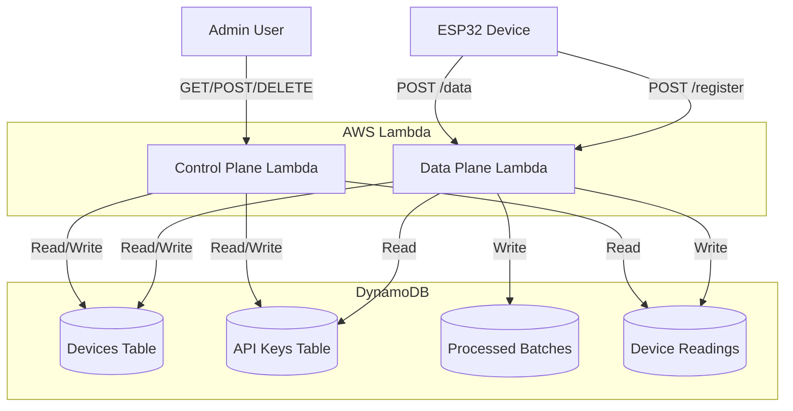
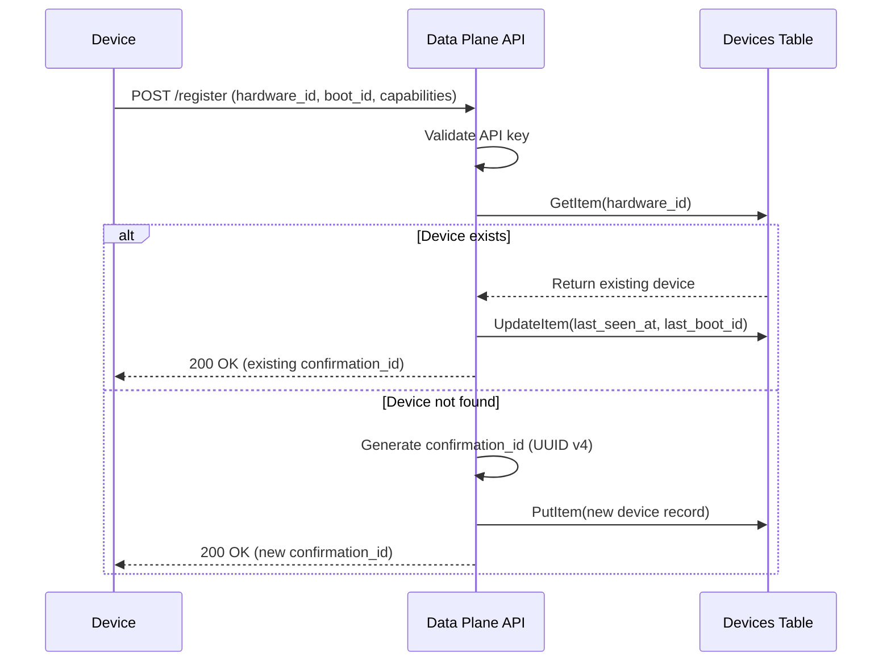
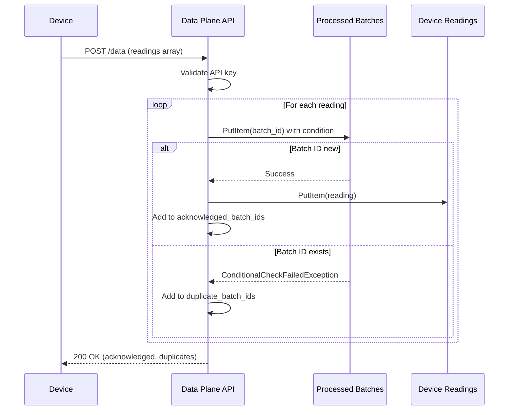

# Design Document: Serverless Backend API

## Overview

This design document describes a serverless backend API system for ESP32 environmental monitoring devices. The system consists of two AWS Lambda functions written in Rust, deployed as "lambdaliths" (single binaries with internal routing) and triggered by Function URLs. The Data Plane API handles high-volume device operations (registration and sensor data ingestion), while the Control Plane API provides administrative functions for managing API keys, devices, and querying sensor data history.

**Security Model**:
- **Function URLs** are public HTTPS endpoints with AuthType NONE
- **All security is application-level**: API keys for Data Plane, Bearer tokens for Control Plane
- No AWS IAM authentication at the Function URL layer

**Data Storage Strategy**:
- **DynamoDB** is the system of record for all application data (devices, API keys, sensor readings)
- **CloudWatch** is used for operational telemetry (Lambda metrics, logs, alarms, DynamoDB metrics)

The architecture prioritizes:
- **Scalability**: Serverless auto-scaling handles variable device loads
- **Cost efficiency**: Pay-per-request pricing with ARM64 Lambda functions
- **Simplicity**: Lambdalith pattern reduces cold starts and deployment complexity
- **Data durability**: DynamoDB provides persistent storage with automatic backups
- **Query flexibility**: Efficient time-series queries for device readings

Key design decisions:
- DynamoDB as primary data store (not CloudWatch) for queryable sensor history
- Idempotent processing using conditional writes to prevent duplicate data
- Hashed API key storage for security
- Composite sort keys for efficient time-range queries
- GSI for listing devices sorted by activity

## Architecture

### System Components



### Data Flow

**Device Registration Flow:**



**Sensor Data Ingestion Flow:**



## Components and Interfaces

### 1. Data Plane Lambda Function

**Purpose**: Handle device registration and sensor data ingestion with high throughput.

**Rust Project Structure**:
```
data-plane/
├── src/
│   ├── main.rs              # Lambda entry point, router
│   ├── handlers/
│   │   ├── mod.rs
│   │   ├── register.rs      # POST /register handler
│   │   ├── data.rs          # POST /data handler
│   │   └── health.rs        # GET /health handler
│   ├── domain/
│   │   ├── mod.rs
│   │   ├── device.rs        # Device types and validation
│   │   └── reading.rs       # Reading types and validation
│   ├── repo/
│   │   ├── mod.rs
│   │   ├── devices.rs       # Devices table operations
│   │   ├── api_keys.rs      # API keys table operations
│   │   ├── batches.rs       # Processed batches operations
│   │   └── readings.rs      # Device readings operations
│   ├── auth.rs              # API key validation
│   ├── error.rs             # Error types and HTTP mapping
│   └── router.rs            # Path routing logic
├── Cargo.toml
└── README.md
```

**Key Dependencies**:
- `lambda_runtime` - AWS Lambda runtime for Rust
- `lambda_http` - HTTP event handling for Lambda
- `aws-sdk-dynamodb` - DynamoDB client
- `serde` and `serde_json` - JSON serialization
- `tokio` - Async runtime
- `uuid` - UUID generation
- `sha2` - For API key hashing (validation against stored hashes)

**Router Implementation**:
```rust
pub async fn route_request(event: Request) -> Result<Response<Body>, Error> {
    let path = event.uri().path();
    let method = event.method();

    match (method, path) {
        (&Method::POST, "/register") => handlers::register::handle(event).await,
        (&Method::POST, "/data") => handlers::data::handle(event).await,
        (&Method::GET, "/health") => handlers::health::handle(event).await,
        _ => Ok(Response::builder()
            .status(404)
            .body(Body::from(json!({"error": "Not found"}).to_string()))
            .unwrap()),
    }
}
```

### 2. Control Plane Lambda Function

**Purpose**: Provide administrative API for managing API keys, devices, and querying sensor data.

**Rust Project Structure**:
```
control-plane/
├── src/
│   ├── main.rs              # Lambda entry point, router
│   ├── handlers/
│   │   ├── mod.rs
│   │   ├── api_keys.rs      # API key CRUD operations
│   │   ├── devices.rs       # Device listing and detail
│   │   ├── readings.rs      # Reading queries
│   │   └── health.rs        # GET /health handler
│   ├── domain/
│   │   ├── mod.rs
│   │   ├── api_key.rs       # API key types
│   │   ├── device.rs        # Device types
│   │   └── reading.rs       # Reading types
│   ├── repo/
│   │   ├── mod.rs
│   │   ├── devices.rs       # Devices table operations
│   │   ├── api_keys.rs      # API keys table operations
│   │   └── readings.rs      # Device readings operations
│   ├── auth.rs              # Bearer token validation
│   ├── error.rs             # Error types and HTTP mapping
│   ├── router.rs            # Path routing logic
│   └── cors.rs              # CORS header handling
├── Cargo.toml
└── README.md
```

**Router Implementation**:
```rust
pub async fn route_request(event: Request) -> Result<Response<Body>, Error> {
    let path = event.uri().path();
    let method = event.method();

    // Handle CORS preflight
    if method == Method::OPTIONS {
        return Ok(cors::preflight_response());
    }

    let response = match (method, path) {
        (&Method::POST, "/api-keys") => handlers::api_keys::create(event).await,
        (&Method::GET, "/api-keys") => handlers::api_keys::list(event).await,
        (&Method::DELETE, path) if path.starts_with("/api-keys/") => {
            handlers::api_keys::delete(event).await
        },
        (&Method::GET, "/devices") => handlers::devices::list(event).await,
        (&Method::GET, path) if path.starts_with("/devices/") => {
            route_device_path(event, path).await
        },
        (&Method::GET, "/health") => handlers::health::handle(event).await,
        _ => Ok(not_found_response()),
    }?;

    Ok(cors::add_headers(response))
}
```


## Data Models

### DynamoDB Table Schemas

#### 1. Devices Table

**Purpose**: Store device registration information and track device activity.

**Schema**:
```
Table: devices
Partition Key: hardware_id (String)
Attributes:
  - hardware_id: String (MAC address, e.g., "AA:BB:CC:DD:EE:FF")
  - confirmation_id: String (UUID v4)
  - friendly_name: String (optional)
  - firmware_version: String
  - capabilities: Map
    - sensors: List<String>
    - features: Map<String, Boolean>
  - first_registered_at: String (ISO 8601)
  - last_seen_at: String (ISO 8601)
  - last_boot_id: String (UUID v4)
  - gsi1pk: String (constant "devices")
  - gsi1sk: String (copy of last_seen_at for sorting)

GSI1 (for listing devices sorted by activity):
  Partition Key: gsi1pk (String, constant "devices")
  Sort Key: gsi1sk (String, last_seen_at timestamp)
  Projection: ALL
```

**Example Record**:
```json
{
  "hardware_id": "AA:BB:CC:DD:EE:FF",
  "confirmation_id": "550e8400-e29b-41d4-a716-446655440000",
  "friendly_name": "greenhouse-sensor-01",
  "firmware_version": "1.0.16",
  "capabilities": {
    "sensors": ["bme280", "ds18b20", "soil_moisture"],
    "features": {
      "tft_display": true,
      "offline_buffering": true
    }
  },
  "first_registered_at": "2024-01-15T10:30:00Z",
  "last_seen_at": "2024-01-15T14:22:00Z",
  "last_boot_id": "7c9e6679-7425-40de-944b-e07fc1f90ae7",
  "gsi1pk": "devices",
  "gsi1sk": "2024-01-15T14:22:00Z"
}
```

**Friendly Name Mutability**:
The `friendly_name` field is mutable and can be updated via the Control Plane API. Historical sensor readings preserve the friendly_name value at the time of ingestion as a snapshot, so changes to the device's friendly_name do not affect previously stored readings.

**Timestamp Format Convention**:
All timestamp fields (`first_registered_at`, `last_seen_at`, `created_at`, `last_used_at`, `received_at`) SHALL be RFC3339 UTC with Z suffix (e.g., `2024-01-15T10:30:00Z`). This ensures lexicographic sorting works correctly for GSI queries.

#### 2. API Keys Table

**Purpose**: Store API keys for device authentication.

**Schema**:
```
Table: api_keys
Partition Key: key_id (String, UUID v4)
Attributes:
  - key_id: String (UUID v4)
  - api_key_hash: String (SHA-256 hash of the raw key)
  - created_at: String (ISO 8601)
  - last_used_at: String (ISO 8601, optional)
  - is_active: Boolean
  - description: String (optional, for admin reference)

GSI1 (for lookup by hashed key):
  Partition Key: api_key_hash (String)
  Projection: ALL
```

**Example Record**:
```json
{
  "key_id": "a1b2c3d4-e5f6-7890-abcd-ef1234567890",
  "api_key_hash": "5e884898da28047151d0e56f8dc6292773603d0d6aabbdd62a11ef721d1542d8",
  "created_at": "2024-01-10T08:00:00Z",
  "last_used_at": "2024-01-15T14:22:00Z",
  "is_active": true,
  "description": "Production devices - greenhouse cluster"
}
```

**API Key Generation and Hashing**:
```rust
use sha2::{Sha256, Digest};
use rand::Rng;

pub fn generate_api_key() -> String {
    let mut rng = rand::thread_rng();
    let bytes: Vec<u8> = (0..32).map(|_| rng.gen()).collect();
    hex::encode(bytes)
}

pub fn hash_api_key(key: &str) -> String {
    let pepper = std::env::var("API_KEY_PEPPER")
        .expect("API_KEY_PEPPER must be set");

    let mut hasher = Sha256::new();
    hasher.update(pepper.as_bytes());
    hasher.update(key.as_bytes());
    hex::encode(hasher.finalize())
}
```

**Security Note**: The hash includes a system-wide secret "pepper" stored in an environment variable. This improves security if the database is leaked, as the pepper is never stored in DynamoDB.


#### 3. Processed Batches Table

**Purpose**: Track processed batch IDs for idempotent data ingestion.

**Batch ID Format**: The batch_id is generated by the device firmware and follows the format:
```
{hardware_id}_{boot_id}_{window_start_ms}_{window_end_ms}
```

This format ensures:
- Stability: Uses hardware_id (immutable MAC address) not friendly_name (which can change)
- Uniqueness: Includes boot_id to distinguish between device restarts
- Determinism: Same time window produces same batch_id for idempotent retries

**Schema**:
```
Table: processed_batches
Partition Key: batch_id (String)
Attributes:
  - batch_id: String (format: "{hardware_id}_{boot_id}_{start_ms}_{end_ms}")
  - hardware_id: String (MAC address)
  - received_at: String (ISO 8601)
  - expiration_time: Number (epoch seconds, for TTL)

TTL Attribute: expiration_time (30 days from received_at)
```

**Example Record**:
```json
{
  "batch_id": "AA:BB:CC:DD:EE:FF_7c9e6679-7425-40de-944b-e07fc1f90ae7_1704067200000_1704067800000",
  "hardware_id": "AA:BB:CC:DD:EE:FF",
  "received_at": "2024-01-15T14:22:00Z",
  "expiration_time": 1707235320
}
```

#### 4. Device Readings Table

**Purpose**: Store time-series sensor data for querying and analysis.

**Schema**:
```
Table: device_readings
Partition Key: hardware_id (String)
Sort Key: ts_batch (String, format: "{timestamp_ms}#{batch_id}")
Attributes:
  - hardware_id: String (MAC address)
  - ts_batch: String (composite sort key)
  - timestamp_ms: Number (epoch milliseconds)
  - batch_id: String
  - boot_id: String (UUID v4)
  - firmware_version: String
  - friendly_name: String (optional snapshot)
  - sensors: Map
    - bme280_temp_c: Number (optional)
    - ds18b20_temp_c: Number (optional)
    - humidity_pct: Number (optional)
    - pressure_hpa: Number (optional)
    - soil_moisture_pct: Number (optional)
  - sensor_status: Map
    - bme280: String ("ok" or "error")
    - ds18b20: String ("ok" or "error")
    - soil_moisture: String ("ok" or "error")
  - expiration_time: Number (optional, epoch seconds for TTL)
```

**Example Record**:
```json
{
  "hardware_id": "AA:BB:CC:DD:EE:FF",
  "ts_batch": "1704067800000#AA:BB:CC:DD:EE:FF_7c9e6679-7425-40de-944b-e07fc1f90ae7_1704067200000_1704067800000",
  "timestamp_ms": 1704067800000,
  "batch_id": "AA:BB:CC:DD:EE:FF_7c9e6679-7425-40de-944b-e07fc1f90ae7_1704067200000_1704067800000",
  "boot_id": "7c9e6679-7425-40de-944b-e07fc1f90ae7",
  "firmware_version": "1.0.16",
  "friendly_name": "greenhouse-sensor-01",
  "sensors": {
    "bme280_temp_c": 22.5,
    "ds18b20_temp_c": 21.8,
    "humidity_pct": 45.2,
    "pressure_hpa": 1013.25,
    "soil_moisture_pct": 62.3
  },
  "sensor_status": {
    "bme280": "ok",
    "ds18b20": "ok",
    "soil_moisture": "ok"
  }
}
```

**Query Patterns**:
- Latest reading: Query by `hardware_id`, `ScanIndexForward=false`, `Limit=1`
- Time range: Query by `hardware_id` with `KeyConditionExpression` on `ts_batch` between `{from_ms}#` and `{to_ms}#\uffff`
- Pagination: Use `LastEvaluatedKey` for cursor-based pagination


### Domain Types

**Rust Type Definitions**:

```rust
use serde::{Deserialize, Serialize};
use std::collections::HashMap;

// Device domain types
#[derive(Debug, Clone, Serialize, Deserialize)]
pub struct Device {
    pub hardware_id: String,
    pub confirmation_id: String,
    pub friendly_name: Option<String>,
    pub firmware_version: String,
    pub capabilities: Capabilities,
    pub first_registered_at: String,
    pub last_seen_at: String,
    pub last_boot_id: String,
}

#[derive(Debug, Clone, Serialize, Deserialize)]
pub struct Capabilities {
    pub sensors: Vec<String>,
    pub features: HashMap<String, bool>,
}

// Reading domain types
#[derive(Debug, Clone, Serialize, Deserialize)]
pub struct Reading {
    pub batch_id: String,
    pub hardware_id: String,
    pub timestamp_ms: i64,
    pub boot_id: String,
    pub firmware_version: String,
    pub friendly_name: Option<String>,
    pub sensors: SensorValues,
    pub sensor_status: SensorStatus,
}

#[derive(Debug, Clone, Serialize, Deserialize)]
pub struct SensorValues {
    pub bme280_temp_c: Option<f64>,
    pub ds18b20_temp_c: Option<f64>,
    pub humidity_pct: Option<f64>,
    pub pressure_hpa: Option<f64>,
    pub soil_moisture_pct: Option<f64>,
}

#[derive(Debug, Clone, Serialize, Deserialize)]
pub struct SensorStatus {
    pub bme280: String,
    pub ds18b20: String,
    pub soil_moisture: String,
}

// API Key domain types
#[derive(Debug, Clone, Serialize, Deserialize)]
pub struct ApiKey {
    pub key_id: String,
    pub api_key_hash: String,
    pub created_at: String,
    pub last_used_at: Option<String>,
    pub is_active: bool,
    pub description: Option<String>,
}
```

### Request/Response Payloads

**POST /register Request**:
```json
{
  "hardware_id": "AA:BB:CC:DD:EE:FF",
  "boot_id": "550e8400-e29b-41d4-a716-446655440000",
  "firmware_version": "1.0.16",
  "friendly_name": "greenhouse-sensor-01",
  "capabilities": {
    "sensors": ["bme280", "ds18b20", "soil_moisture"],
    "features": {
      "tft_display": true,
      "offline_buffering": true
    }
  }
}
```

**POST /register Response**:
```json
{
  "status": "registered",
  "confirmation_id": "7c9e6679-7425-40de-944b-e07fc1f90ae7",
  "hardware_id": "AA:BB:CC:DD:EE:FF",
  "registered_at": "2024-01-15T10:30:00Z"
}
```

**POST /data Request**:
```json
{
  "readings": [
    {
      "batch_id": "AA:BB:CC:DD:EE:FF_7c9e6679-7425-40de-944b-e07fc1f90ae7_1704067200000_1704067800000",
      "hardware_id": "AA:BB:CC:DD:EE:FF",
      "boot_id": "7c9e6679-7425-40de-944b-e07fc1f90ae7",
      "firmware_version": "1.0.16",
      "timestamp_ms": 1704067800000,
      "friendly_name": "greenhouse-sensor-01",
      "sensors": {
        "bme280_temp_c": 22.5,
        "ds18b20_temp_c": 21.8,
        "humidity_pct": 45.2,
        "pressure_hpa": 1013.25,
        "soil_moisture_pct": 62.3
      },
      "sensor_status": {
        "bme280": "ok",
        "ds18b20": "ok",
        "soil_moisture": "ok"
      }
    }
  ]
}
```

**POST /data Response**:
```json
{
  "acknowledged_batch_ids": ["AA:BB:CC:DD:EE:FF_7c9e6679-7425-40de-944b-e07fc1f90ae7_1704067200000_1704067800000"],
  "duplicate_batch_ids": []
}
```


**GET /devices Response**:
```json
{
  "devices": [
    {
      "hardware_id": "AA:BB:CC:DD:EE:FF",
      "confirmation_id": "7c9e6679-7425-40de-944b-e07fc1f90ae7",
      "friendly_name": "greenhouse-sensor-01",
      "firmware_version": "1.0.16",
      "first_registered_at": "2024-01-15T10:30:00Z",
      "last_seen_at": "2024-01-15T14:22:00Z"
    }
  ],
  "next_cursor": "eyJoYXJkd2FyZV9pZCI6IkFBOkJCOkNDOkREOkVFOkZGIn0="
}
```

**GET /devices/{hardware_id}/readings Response**:
```json
{
  "readings": [
    {
      "timestamp_ms": 1704067800000,
      "batch_id": "AA:BB:CC:DD:EE:FF_7c9e6679-7425-40de-944b-e07fc1f90ae7_1704067200000_1704067800000",
      "boot_id": "7c9e6679-7425-40de-944b-e07fc1f90ae7",
      "firmware_version": "1.0.16",
      "sensors": {
        "bme280_temp_c": 22.5,
        "humidity_pct": 45.2,
        "pressure_hpa": 1013.25,
        "soil_moisture_pct": 62.3
      },
      "sensor_status": {
        "bme280": "ok",
        "ds18b20": "ok",
        "soil_moisture": "ok"
      }
    }
  ],
  "next_cursor": "eyJoYXJkd2FyZV9pZCI6IkFBOkJCOkNDOkREOkVFOkZGIiwidHNfYmF0Y2giOiIxNzA0MDY3ODAwMDAwI0FBOkJCOkNDOkREOkVFOkZGXzdjOWU2Njc5LTc0MjUtNDBkZS05NDRiLWUwN2ZjMWY5MGFlN18xNzA0MDY3MjAwMDAwXzE3MDQwNjc4MDAwMDAifQ=="
}
```

**POST /api-keys Response**:
```json
{
  "key_id": "a1b2c3d4-e5f6-7890-abcd-ef1234567890",
  "api_key": "5e884898da28047151d0e56f8dc6292773603d0d6aabbdd62a11ef721d1542d8",
  "created_at": "2024-01-15T14:30:00Z",
  "message": "API key created successfully. Save this key - it will not be shown again."
}
```

## Authentication and Authorization

### Data Plane Authentication (API Keys)

**Flow**:
1. Device includes `X-API-Key` header in request
2. Lambda extracts key from header
3. Lambda hashes the key using SHA-256 with pepper
4. Lambda queries `api_keys` table GSI by `api_key_hash`
5. If found and `is_active=true`, request proceeds
6. Lambda updates `last_used_at` timestamp inline (only if older than 5 minutes to reduce write load)
7. If not found or inactive, return 401 Unauthorized

**Implementation**:
```rust
pub async fn validate_api_key(
    client: &DynamoDbClient,
    table_name: &str,
    api_key: &str,
) -> Result<ApiKey, AuthError> {
    let key_hash = hash_api_key(api_key);

    let result = client
        .query()
        .table_name(table_name)
        .index_name("api_key_hash_index")
        .key_condition_expression("api_key_hash = :hash")
        .expression_attribute_values(":hash", AttributeValue::S(key_hash))
        .send()
        .await?;

    let items = result.items.ok_or(AuthError::InvalidKey)?;
    if items.is_empty() {
        return Err(AuthError::InvalidKey);
    }

    let api_key_record: ApiKey = from_item(items[0].clone())?;

    if !api_key_record.is_active {
        return Err(AuthError::KeyRevoked);
    }

    // Update last_used_at inline if older than 5 minutes
    if should_update_last_used(&api_key_record.last_used_at) {
        update_last_used(client, table_name, &api_key_record.key_id).await?;
    }

    Ok(api_key_record)
}

fn should_update_last_used(last_used: &Option<String>) -> bool {
    match last_used {
        None => true,
        Some(ts) => {
            let last = chrono::DateTime::parse_from_rfc3339(ts).ok();
            let now = chrono::Utc::now();
            last.map(|l| (now - l).num_minutes() >= 5).unwrap_or(true)
        }
    }
}
```

**Note on last_used_at Updates**: Updates are performed inline (not fire-and-forget) but throttled to once per 5 minutes per key to reduce write load. This provides reasonable tracking without excessive DynamoDB writes.

### Control Plane Authentication (Bearer Token)

**Flow**:
1. Admin includes `Authorization: Bearer <token>` header
2. Lambda extracts token from header
3. Lambda compares token against environment variable `ADMIN_TOKEN`
4. If match, request proceeds
5. If no match, return 401 Unauthorized

**Implementation**:
```rust
pub fn validate_bearer_token(event: &Request) -> Result<(), AuthError> {
    let auth_header = event
        .headers()
        .get("authorization")
        .and_then(|v| v.to_str().ok())
        .ok_or(AuthError::MissingToken)?;

    if !auth_header.starts_with("Bearer ") {
        return Err(AuthError::InvalidFormat);
    }

    let token = &auth_header[7..];
    let expected_token = std::env::var("ADMIN_TOKEN")
        .map_err(|_| AuthError::ConfigError)?;

    if token != expected_token {
        return Err(AuthError::InvalidToken);
    }

    Ok(())
}
```


## Idempotency Implementation

### Transactional Write Strategy

The system uses DynamoDB transactions to ensure atomic idempotency checks and reading writes. This guarantees that either both the batch_id record and the reading are written, or neither is written.

**Algorithm**:
```rust
pub async fn process_readings(
    client: &DynamoDbClient,
    batches_table: &str,
    readings_table: &str,
    readings: Vec<Reading>,
) -> ProcessResult {
    let mut acknowledged = Vec::new();
    let mut duplicates = Vec::new();

    for reading in readings {
        // Prepare batch record
        let batch_record = ProcessedBatch {
            batch_id: reading.batch_id.clone(),
            hardware_id: reading.hardware_id.clone(),
            received_at: Utc::now().to_rfc3339(),
            expiration_time: (Utc::now().timestamp() + 30 * 24 * 3600) as i64,
        };

        // Prepare reading record
        let reading_record = to_reading_item(&reading)?;

        // Use transaction to write both atomically
        let transact_result = client
            .transact_write_items()
            .transact_items(
                TransactWriteItem::builder()
                    .put(
                        Put::builder()
                            .table_name(batches_table)
                            .set_item(Some(to_item(batch_record)?))
                            .condition_expression("attribute_not_exists(batch_id)")
                            .build()
                    )
                    .build()
            )
            .transact_items(
                TransactWriteItem::builder()
                    .put(
                        Put::builder()
                            .table_name(readings_table)
                            .set_item(Some(reading_record))
                            .build()
                    )
                    .build()
            )
            .send()
            .await;

        match transact_result {
            Ok(_) => {
                // Transaction succeeded, both writes completed
                acknowledged.push(reading.batch_id.clone());
            }
            Err(e) if is_transaction_canceled_conditional_check(&e) => {
                // Duplicate batch_id, transaction rolled back
                duplicates.push(reading.batch_id.clone());
            }
            Err(e) => return Err(e.into()),
        }
    }

    Ok(ProcessResult {
        acknowledged_batch_ids: acknowledged,
        duplicate_batch_ids: duplicates,
    })
}

fn is_transaction_canceled_conditional_check(err: &SdkError<TransactWriteItemsError>) -> bool {
    matches!(
        err,
        SdkError::ServiceError { err, .. }
            if matches!(err.kind, TransactWriteItemsErrorKind::TransactionCanceledException(_))
    )
}
```

**Benefits of Transactional Approach**:
- **Atomicity**: Either both batch_id and reading are written, or neither is written
- **No orphaned state**: Cannot have a processed batch_id without a corresponding reading
- **Correctness**: Guarantees idempotency without recovery logic
- **Simplicity**: No need for status tracking or retry mechanisms

**Cost Consideration**: TransactWriteItems costs 2x standard writes, but for 100 readings max per request, this is acceptable for correctness guarantees.

**TTL Configuration**:
- Processed batches expire after 30 days
- `expiration_time` attribute set to epoch seconds
- DynamoDB automatically deletes expired items
- Prevents unbounded table growth

## Error Handling

### Error Type Hierarchy

```rust
#[derive(Debug)]
pub enum ApiError {
    // Authentication errors
    Auth(AuthError),

    // Validation errors
    Validation(ValidationError),

    // Database errors
    Database(DatabaseError),

    // Not found errors
    NotFound(NotFoundError),

    // Internal errors
    Internal(String),
}

#[derive(Debug)]
pub enum AuthError {
    MissingKey,
    InvalidKey,
    KeyRevoked,
    MissingToken,
    InvalidToken,
    InvalidFormat,
    ConfigError,
}

#[derive(Debug)]
pub enum ValidationError {
    MissingField(String),
    InvalidFormat(String),
    InvalidValue(String),
    BatchSizeExceeded,
}

#[derive(Debug)]
pub enum NotFoundError {
    DeviceNotFound,
    NoReadings,
    ApiKeyNotFound,
}
```

### HTTP Status Code Mapping

```rust
impl ApiError {
    pub fn to_http_response(&self) -> Response<Body> {
        let (status, error_code, message) = match self {
            ApiError::Auth(AuthError::MissingKey) =>
                (401, "MISSING_API_KEY", "X-API-Key header is required"),
            ApiError::Auth(AuthError::InvalidKey) =>
                (401, "INVALID_API_KEY", "API key is invalid or not found"),
            ApiError::Auth(AuthError::KeyRevoked) =>
                (401, "KEY_REVOKED", "API key has been revoked"),
            ApiError::Auth(AuthError::MissingToken) =>
                (401, "MISSING_TOKEN", "Authorization header is required"),
            ApiError::Auth(AuthError::InvalidToken) =>
                (401, "INVALID_TOKEN", "Bearer token is invalid"),

            ApiError::Validation(ValidationError::MissingField(field)) =>
                (400, "MISSING_FIELD", &format!("Required field missing: {}", field)),
            ApiError::Validation(ValidationError::InvalidFormat(field)) =>
                (400, "INVALID_FORMAT", &format!("Invalid format for field: {}", field)),
            ApiError::Validation(ValidationError::BatchSizeExceeded) =>
                (400, "BATCH_SIZE_EXCEEDED", "Batch size exceeds maximum of 100 readings"),

            ApiError::NotFound(NotFoundError::DeviceNotFound) =>
                (404, "DEVICE_NOT_FOUND", "Device not found"),
            ApiError::NotFound(NotFoundError::NoReadings) =>
                (404, "NO_READINGS", "Device exists but has no readings"),

            ApiError::Database(_) =>
                (500, "DATABASE_ERROR", "Internal database error"),
            ApiError::Internal(_) =>
                (500, "INTERNAL_ERROR", "Internal server error"),
        };

        let body = json!({
            "error": error_code,
            "message": message,
        });

        Response::builder()
            .status(status)
            .header("Content-Type", "application/json")
            .body(Body::from(body.to_string()))
            .unwrap()
    }
}
```


### Logging Strategy

**Structured Logging**:
```rust
use tracing::{info, warn, error};

// Request logging
info!(
    request_id = %request_id,
    method = %method,
    path = %path,
    "Incoming request"
);

// Authentication logging (mask sensitive data)
warn!(
    request_id = %request_id,
    api_key_prefix = &api_key[..8],
    "Invalid API key attempted"
);

// Error logging
error!(
    request_id = %request_id,
    error = %err,
    "Database operation failed"
);

// Success logging
info!(
    request_id = %request_id,
    device_id = %hardware_id,
    acknowledged_count = acknowledged.len(),
    duplicate_count = duplicates.len(),
    "Processed sensor data batch"
);
```

## Pagination Implementation

### Cursor-Based Pagination

DynamoDB uses `LastEvaluatedKey` for pagination. We encode this as a base64 cursor using custom structs for stability:

```rust
use base64::{Engine as _, engine::general_purpose};
use serde::{Deserialize, Serialize};

#[derive(Debug, Serialize, Deserialize)]
pub struct DeviceListCursor {
    pub hardware_id: String,
    pub gsi1sk: String,
}

#[derive(Debug, Serialize, Deserialize)]
pub struct ReadingsCursor {
    pub hardware_id: String,
    pub ts_batch: String,
}

pub fn encode_device_cursor(hardware_id: &str, gsi1sk: &str) -> String {
    let cursor = DeviceListCursor {
        hardware_id: hardware_id.to_string(),
        gsi1sk: gsi1sk.to_string(),
    };
    let json = serde_json::to_string(&cursor).unwrap();
    general_purpose::STANDARD.encode(json.as_bytes())
}

pub fn decode_device_cursor(cursor: &str) -> Result<DeviceListCursor, ApiError> {
    let bytes = general_purpose::STANDARD
        .decode(cursor)
        .map_err(|_| ValidationError::InvalidFormat("cursor".to_string()))?;

    let json = String::from_utf8(bytes)
        .map_err(|_| ValidationError::InvalidFormat("cursor".to_string()))?;

    serde_json::from_str(&json)
        .map_err(|_| ValidationError::InvalidFormat("cursor".to_string()))
}

fn cursor_to_exclusive_start_key(cursor: &DeviceListCursor) -> HashMap<String, AttributeValue> {
    let mut key = HashMap::new();
    key.insert("hardware_id".to_string(), AttributeValue::S(cursor.hardware_id.clone()));
    key.insert("gsi1pk".to_string(), AttributeValue::S("devices".to_string()));
    key.insert("gsi1sk".to_string(), AttributeValue::S(cursor.gsi1sk.clone()));
    key
}
```

**Query with Pagination**:
```rust
pub async fn list_devices(
    client: &DynamoDbClient,
    table_name: &str,
    limit: i32,
    cursor: Option<String>,
) -> Result<DeviceListResponse, ApiError> {
    let mut query = client
        .query()
        .table_name(table_name)
        .index_name("gsi1")
        .key_condition_expression("gsi1pk = :pk")
        .expression_attribute_values(":pk", AttributeValue::S("devices".to_string()))
        .scan_index_forward(false)  // Most recent first
        .limit(limit);

    if let Some(cursor_str) = cursor {
        let cursor = decode_device_cursor(&cursor_str)?;
        let start_key = cursor_to_exclusive_start_key(&cursor);
        query = query.set_exclusive_start_key(Some(start_key));
    }

    let result = query.send().await?;

    let devices: Vec<Device> = result
        .items
        .unwrap_or_default()
        .into_iter()
        .map(from_item)
        .collect::<Result<Vec<_>, _>>()?;

    let next_cursor = result
        .last_evaluated_key
        .and_then(|key| {
            let hardware_id = key.get("hardware_id")?.as_s().ok()?;
            let gsi1sk = key.get("gsi1sk")?.as_s().ok()?;
            Some(encode_device_cursor(hardware_id, gsi1sk))
        });

    Ok(DeviceListResponse {
        devices,
        next_cursor,
    })
}
```

**Benefits of Custom Cursor Structs**:
- Stable serialization format (not dependent on AWS SDK internals)
- Readable and debuggable cursors
- Type-safe cursor handling
- Explicit field extraction from DynamoDB keys

## CORS Configuration

**CORS Headers**:
```rust
pub fn add_cors_headers(mut response: Response<Body>) -> Response<Body> {
    let headers = response.headers_mut();

    let allowed_origin = std::env::var("CORS_ALLOWED_ORIGIN")
        .unwrap_or_else(|_| "*".to_string());

    headers.insert("Access-Control-Allow-Origin", allowed_origin.parse().unwrap());
    headers.insert("Access-Control-Allow-Methods", "GET, POST, PUT, DELETE, OPTIONS".parse().unwrap());
    headers.insert("Access-Control-Allow-Headers", "Content-Type, Authorization, X-API-Key".parse().unwrap());
    headers.insert("Access-Control-Max-Age", "3600".parse().unwrap());

    response
}

pub fn preflight_response() -> Response<Body> {
    let response = Response::builder()
        .status(200)
        .body(Body::empty())
        .unwrap();

    add_cors_headers(response)
}
```


## Correctness Properties

A property is a characteristic or behavior that should hold true across all valid executions of a system—essentially, a formal statement about what the system should do. Properties serve as the bridge between human-readable specifications and machine-verifiable correctness guarantees.

The following properties define the correctness criteria for the serverless backend API. Each property is universally quantified and references the specific requirements it validates.

### Property 1: API Key Validation for Registration

*For any* registration request, if the request includes a valid API key in the X-API-Key header, the request should be processed; if the API key is invalid or missing, the request should be rejected with HTTP 401.

**Validates: Requirements 2.1**

### Property 2: New Device Creation

*For any* hardware_id that does not exist in the devices table, when a registration request is made, a new device record should be created with a valid UUID v4 confirmation_id.

**Validates: Requirements 2.2, 2.4**

### Property 3: Registration Idempotency

*For any* hardware_id that already exists in the devices table, when a registration request is made, the response should contain the existing confirmation_id without creating a duplicate device record.

**Validates: Requirements 2.3**

### Property 4: MAC Address Format Validation

*For any* registration or sensor data request, if the hardware_id field does not match the MAC address format (XX:XX:XX:XX:XX:XX with uppercase hexadecimal), the request should be rejected with HTTP 400.

**Validates: Requirements 3.5**

### Property 5: UUID v4 Format Validation

*For any* registration request, if the boot_id field is not a valid UUID v4 format (8-4-4-4-12 hexadecimal characters with correct version and variant bits), the request should be rejected with HTTP 400.

**Validates: Requirements 3.6**

### Property 6: Re-registration Updates Timestamps

*For any* device that re-registers, the last_seen_at timestamp should be updated to the current time and the last_boot_id should be updated to the new boot_id from the request.

**Validates: Requirements 4.10**

### Property 7: Batch ID Idempotency

*For any* batch_id, when sensor data with that batch_id is submitted multiple times, the reading should only be written to the device_readings table once, and subsequent submissions should be identified as duplicates.

**Validates: Requirements 5.6**

### Property 8: Timestamp Type Validation

*For any* sensor data request, if the timestamp_ms field is not a 64-bit integer representing epoch milliseconds, the request should be rejected with HTTP 400.

**Validates: Requirements 6.4**

### Property 9: Response Batch ID Partitioning

*For any* sensor data submission containing multiple readings, the response should partition batch_ids such that acknowledged_batch_ids contains only newly processed batch_ids and duplicate_batch_ids contains only previously seen batch_ids, with no overlap between the two sets.

**Validates: Requirements 8.6, 8.7**

### Property 10: API Key Usage Tracking

*For any* valid API key used in a request, the last_used_at timestamp for that API key should be updated periodically to reflect recent usage (throttled to once per 5 minutes to reduce write load).

**Validates: Requirements 9.6**

### Property 11: API Key Hashing

*For any* API key created through the Control Plane API, the stored api_key_hash field should be a SHA-256 hash of the raw key, and the raw key value should never be stored in the database after the creation response is returned.

**Validates: Requirements 11.6, 11.7**

### Property 12: Device List Sort Order

*For any* query to list devices, the returned devices should be sorted by last_seen_at in descending order (most recent first).

**Validates: Requirements 12.7**

### Property 13: Reading List Sort Order

*For any* query for device readings, the returned readings should be sorted by timestamp_ms in descending order (newest first) by default.

**Validates: Requirements 14.7**

### Property 14: GSI Partition Key Consistency

*For any* device record created or updated, the gsi1pk attribute should be set to the constant string value "devices".

**Validates: Requirements 18.4**

### Property 15: Batch Size Limit Enforcement

*For any* sensor data request, if the readings array contains more than 100 readings, the request should be rejected with HTTP 400 and an error message indicating the batch size limit was exceeded. This validation occurs after authentication to avoid leaking validation behavior to unauthenticated callers.

**Validates: Requirements 22.4, 22.5**


## Testing Strategy

The testing strategy employs both unit tests and property-based tests to ensure comprehensive coverage of the serverless backend API functionality.

### Unit Testing

Unit tests validate specific examples, edge cases, and error conditions using Rust's built-in testing framework and the `tokio-test` crate for async tests.

**Test Categories**:

1. **Authentication**
   - Valid API key acceptance
   - Invalid API key rejection
   - Missing API key handling
   - Revoked API key rejection
   - Bearer token validation
   - Token format validation

2. **Request Validation**
   - Required field presence
   - Field format validation (MAC address, UUID, timestamp)
   - Optional field handling
   - Malformed JSON handling

3. **Device Registration**
   - New device creation
   - Existing device re-registration
   - Confirmation ID generation
   - Timestamp updates

4. **Sensor Data Ingestion**
   - Single reading processing
   - Batch reading processing
   - Idempotency with duplicate batch_ids
   - Response structure validation

5. **DynamoDB Operations**
   - Conditional write success
   - Conditional write failure (duplicate)
   - Query with pagination
   - GSI queries

6. **Error Handling**
   - HTTP status code mapping
   - Error response structure
   - Logging output validation

**Example Unit Test**:
```rust
#[tokio::test]
async fn test_register_new_device() {
    let mock_client = MockDynamoDbClient::new();
    mock_client.expect_get_item().returning(|_| Ok(None));
    mock_client.expect_put_item().returning(|_| Ok(()));

    let request = RegisterRequest {
        hardware_id: "AA:BB:CC:DD:EE:FF".to_string(),
        boot_id: "550e8400-e29b-41d4-a716-446655440000".to_string(),
        firmware_version: "1.0.16".to_string(),
        friendly_name: Some("test-device".to_string()),
        capabilities: Capabilities {
            sensors: vec!["bme280".to_string()],
            features: HashMap::new(),
        },
    };

    let response = handle_register(&mock_client, request).await.unwrap();

    assert_eq!(response.status, "registered");
    assert!(uuid::Uuid::parse_str(&response.confirmation_id).is_ok());
}
```

### Property-Based Testing

Property-based tests verify universal properties across many generated inputs using the `proptest` or `quickcheck` crate for Rust.

**Configuration**:
- Minimum 100 iterations per property test
- Each test tagged with feature name and property number
- Tests reference design document properties

**Property Test Generators**:
```rust
use proptest::prelude::*;

// Generate valid MAC addresses
fn mac_address() -> impl Strategy<Value = String> {
    prop::collection::vec(0u8..=255, 6)
        .prop_map(|bytes| {
            bytes.iter()
                .map(|b| format!("{:02X}", b))
                .collect::<Vec<_>>()
                .join(":")
        })
}

// Generate valid UUID v4
fn uuid_v4() -> impl Strategy<Value = String> {
    any::<[u8; 16]>().prop_map(|mut bytes| {
        // Set version bits (4)
        bytes[6] = (bytes[6] & 0x0F) | 0x40;
        // Set variant bits (10xx)
        bytes[8] = (bytes[8] & 0x3F) | 0x80;

        uuid::Uuid::from_bytes(bytes).to_string()
    })
}

// Generate valid timestamps
fn timestamp_ms() -> impl Strategy<Value = i64> {
    1_000_000_000_000i64..2_000_000_000_000i64
}
```

**Example Property Test**:
```rust
proptest! {
    #[test]
    // Feature: serverless-backend-api, Property 4: MAC Address Format Validation
    fn prop_mac_address_validation(
        valid_mac in mac_address(),
        invalid_mac in "[a-z]{17}"
    ) {
        // Valid MAC should pass validation
        assert!(validate_mac_address(&valid_mac).is_ok());

        // Invalid MAC should fail validation
        assert!(validate_mac_address(&invalid_mac).is_err());
    }

    #[test]
    // Feature: serverless-backend-api, Property 7: Batch ID Idempotency
    fn prop_batch_id_idempotency(
        batch_id in "[a-z0-9_]+",
        reading in any::<Reading>()
    ) {
        let mut reading1 = reading.clone();
        let mut reading2 = reading.clone();
        reading1.batch_id = batch_id.clone();
        reading2.batch_id = batch_id.clone();

        // First submission should be acknowledged
        let result1 = process_readings(vec![reading1]).await.unwrap();
        assert_eq!(result1.acknowledged_batch_ids.len(), 1);
        assert_eq!(result1.duplicate_batch_ids.len(), 0);

        // Second submission should be duplicate
        let result2 = process_readings(vec![reading2]).await.unwrap();
        assert_eq!(result2.acknowledged_batch_ids.len(), 0);
        assert_eq!(result2.duplicate_batch_ids.len(), 1);
    }
}
```

### Integration Testing

Integration tests verify end-to-end flows using LocalStack or DynamoDB Local:

1. **Device Registration Flow**
   - Register new device → Verify in DynamoDB
   - Re-register device → Verify confirmation_id unchanged
   - Register with invalid API key → Verify 401 response

2. **Sensor Data Flow**
   - Submit new reading → Verify in device_readings table
   - Submit duplicate reading → Verify not duplicated
   - Submit batch → Verify all processed correctly

3. **Control Plane Queries**
   - List devices → Verify pagination and sorting
   - Query readings → Verify time range filtering
   - Get latest reading → Verify most recent returned

4. **API Key Management**
   - Create API key → Verify hashed storage
   - Use API key → Verify last_used_at updated
   - Revoke API key → Verify requests rejected

### Testing Best Practices

**Unit vs Property Tests**:
- Unit tests focus on specific examples and edge cases
- Property tests verify universal properties across all inputs
- Both are complementary and necessary for comprehensive coverage

**Mocking Strategy**:
- Mock DynamoDB client for unit tests
- Use LocalStack/DynamoDB Local for integration tests
- Mock time/UUID generation for deterministic tests

**Test Organization**:
- Group tests by handler/module
- Use descriptive test names
- Include property number in property test comments
- Tag tests with `#[tokio::test]` for async tests


## Deployment Architecture

### AWS SAM Template Structure

```yaml
AWSTemplateFormatVersion: '2010-09-09'
Transform: AWS::Serverless-2016-10-31
Description: Serverless Backend API for ESP32 Devices

Parameters:
  Environment:
    Type: String
    Default: dev
    AllowedValues: [dev, staging, prod]

  AdminToken:
    Type: String
    NoEcho: true
    Description: Bearer token for Control Plane API authentication

  CorsAllowedOrigin:
    Type: String
    Default: "*"
    Description: Allowed origin for CORS requests

Globals:
  Function:
    Runtime: provided.al2
    Architectures: [arm64]
    MemorySize: 512
    Timeout: 30
    Environment:
      Variables:
        RUST_LOG: info

Resources:
  # DynamoDB Tables
  DevicesTable:
    Type: AWS::DynamoDB::Table
    Properties:
      TableName: !Sub '${Environment}-devices'
      BillingMode: PAY_PER_REQUEST
      PointInTimeRecoverySpecification:
        PointInTimeRecoveryEnabled: true
      AttributeDefinitions:
        - AttributeName: hardware_id
          AttributeType: S
        - AttributeName: gsi1pk
          AttributeType: S
        - AttributeName: gsi1sk
          AttributeType: S
      KeySchema:
        - AttributeName: hardware_id
          KeyType: HASH
      GlobalSecondaryIndexes:
        - IndexName: gsi1
          KeySchema:
            - AttributeName: gsi1pk
              KeyType: HASH
            - AttributeName: gsi1sk
              KeyType: RANGE
          Projection:
            ProjectionType: ALL

  ApiKeysTable:
    Type: AWS::DynamoDB::Table
    Properties:
      TableName: !Sub '${Environment}-api-keys'
      BillingMode: PAY_PER_REQUEST
      PointInTimeRecoverySpecification:
        PointInTimeRecoveryEnabled: true
      AttributeDefinitions:
        - AttributeName: key_id
          AttributeType: S
        - AttributeName: api_key_hash
          AttributeType: S
      KeySchema:
        - AttributeName: key_id
          KeyType: HASH
      GlobalSecondaryIndexes:
        - IndexName: api_key_hash_index
          KeySchema:
            - AttributeName: api_key_hash
              KeyType: HASH
          Projection:
            ProjectionType: ALL

  ProcessedBatchesTable:
    Type: AWS::DynamoDB::Table
    Properties:
      TableName: !Sub '${Environment}-processed-batches'
      BillingMode: PAY_PER_REQUEST
      AttributeDefinitions:
        - AttributeName: batch_id
          AttributeType: S
      KeySchema:
        - AttributeName: batch_id
          KeyType: HASH
      TimeToLiveSpecification:
        Enabled: true
        AttributeName: expiration_time

  DeviceReadingsTable:
    Type: AWS::DynamoDB::Table
    Properties:
      TableName: !Sub '${Environment}-device-readings'
      BillingMode: PAY_PER_REQUEST
      AttributeDefinitions:
        - AttributeName: hardware_id
          AttributeType: S
        - AttributeName: ts_batch
          AttributeType: S
      KeySchema:
        - AttributeName: hardware_id
          KeyType: HASH
        - AttributeName: ts_batch
          KeyType: RANGE
      TimeToLiveSpecification:
        Enabled: true
        AttributeName: expiration_time

  # Data Plane Lambda
  DataPlaneFunction:
    Type: AWS::Serverless::Function
    Properties:
      FunctionName: !Sub '${Environment}-data-plane-api'
      CodeUri: ./data-plane/target/lambda/data-plane/
      Handler: bootstrap
      Environment:
        Variables:
          DEVICES_TABLE: !Ref DevicesTable
          API_KEYS_TABLE: !Ref ApiKeysTable
          PROCESSED_BATCHES_TABLE: !Ref ProcessedBatchesTable
          DEVICE_READINGS_TABLE: !Ref DeviceReadingsTable
      Policies:
        - DynamoDBCrudPolicy:
            TableName: !Ref DevicesTable
        - DynamoDBCrudPolicy:
            TableName: !Ref ApiKeysTable
        - DynamoDBCrudPolicy:
            TableName: !Ref ProcessedBatchesTable
        - DynamoDBCrudPolicy:
            TableName: !Ref DeviceReadingsTable
      FunctionUrlConfig:
        AuthType: NONE

  # Control Plane Lambda
  ControlPlaneFunction:
    Type: AWS::Serverless::Function
    Properties:
      FunctionName: !Sub '${Environment}-control-plane-api'
      CodeUri: ./control-plane/target/lambda/control-plane/
      Handler: bootstrap
      MemorySize: 256
      Environment:
        Variables:
          DEVICES_TABLE: !Ref DevicesTable
          API_KEYS_TABLE: !Ref ApiKeysTable
          DEVICE_READINGS_TABLE: !Ref DeviceReadingsTable
          ADMIN_TOKEN: !Ref AdminToken
          CORS_ALLOWED_ORIGIN: !Ref CorsAllowedOrigin
      Policies:
        - DynamoDBCrudPolicy:
            TableName: !Ref DevicesTable
        - DynamoDBCrudPolicy:
            TableName: !Ref ApiKeysTable
        - DynamoDBReadPolicy:
            TableName: !Ref DeviceReadingsTable
      FunctionUrlConfig:
        AuthType: NONE
        Cors:
          AllowOrigins: [!Ref CorsAllowedOrigin]
          AllowMethods: [GET, POST, PUT, DELETE, OPTIONS]
          AllowHeaders: [Content-Type, Authorization, X-API-Key]
          MaxAge: 3600

Outputs:
  DataPlaneFunctionUrl:
    Description: Data Plane API Function URL
    Value: !GetAtt DataPlaneFunctionUrl.FunctionUrl

  ControlPlaneFunctionUrl:
    Description: Control Plane API Function URL
    Value: !GetAtt ControlPlaneFunctionUrl.FunctionUrl

  DevicesTableName:
    Description: Devices DynamoDB Table Name
    Value: !Ref DevicesTable
```

### Build and Deployment Process

**Build Script** (`build.sh`):
```bash
#!/bin/bash
set -e

echo "Building Data Plane Lambda..."
cd data-plane
cargo lambda build --release --arm64
cd ..

echo "Building Control Plane Lambda..."
cd control-plane
cargo lambda build --release --arm64
cd ..

echo "Build complete!"
```

**Deployment Commands**:
```bash
# Build Lambda functions
./build.sh

# Deploy to dev environment
sam deploy \
  --template-file template.yaml \
  --stack-name serverless-backend-dev \
  --parameter-overrides \
    Environment=dev \
    AdminToken=your-secret-token \
    CorsAllowedOrigin=https://admin.example.com \
  --capabilities CAPABILITY_IAM \
  --resolve-s3

# Deploy to production
sam deploy \
  --template-file template.yaml \
  --stack-name serverless-backend-prod \
  --parameter-overrides \
    Environment=prod \
    AdminToken=your-production-token \
    CorsAllowedOrigin=https://admin.example.com \
  --capabilities CAPABILITY_IAM \
  --resolve-s3
```

### Monitoring and Observability

**CloudWatch Metrics**:
- Lambda invocation count
- Lambda duration
- Lambda errors
- Lambda concurrent executions
- DynamoDB consumed read/write capacity
- DynamoDB throttled requests

**CloudWatch Logs**:
- Structured JSON logs from Lambda functions
- Request/response logging
- Error stack traces
- Performance metrics

**Alarms**:
```yaml
DataPlaneErrorAlarm:
  Type: AWS::CloudWatch::Alarm
  Properties:
    AlarmName: !Sub '${Environment}-data-plane-errors'
    MetricName: Errors
    Namespace: AWS/Lambda
    Statistic: Sum
    Period: 300
    EvaluationPeriods: 1
    Threshold: 10
    ComparisonOperator: GreaterThanThreshold
    Dimensions:
      - Name: FunctionName
        Value: !Ref DataPlaneFunction

DynamoDBThrottleAlarm:
  Type: AWS::CloudWatch::Alarm
  Properties:
    AlarmName: !Sub '${Environment}-dynamodb-throttles'
    MetricName: UserErrors
    Namespace: AWS/DynamoDB
    Statistic: Sum
    Period: 300
    EvaluationPeriods: 1
    Threshold: 5
    ComparisonOperator: GreaterThanThreshold
```

### Security Considerations

**IAM Policies**:
- Least-privilege access for Lambda execution roles
- Separate roles for Data Plane and Control Plane
- No wildcard permissions

**API Security**:
- API keys hashed with SHA-256
- Bearer token for admin access
- HTTPS-only (enforced by Function URLs)
- CORS configured for specific origins in production

**Data Security**:
- DynamoDB encryption at rest (default)
- Point-in-time recovery enabled for critical tables
- TTL for automatic data expiration
- No sensitive data in CloudWatch Logs

**Network Security**:
- Lambda functions in default VPC (no VPC required for DynamoDB)
- Function URLs provide HTTPS endpoints
- No public database access

### Cost Optimization

**Lambda**:
- ARM64 architecture (20% cost savings)
- Right-sized memory allocation (512 MB data plane, 256 MB control plane)
- Efficient code to minimize execution time

**DynamoDB**:
- On-demand billing for variable workloads
- TTL for automatic data cleanup
- Efficient query patterns to minimize read capacity
- Composite sort keys for range queries

**Estimated Monthly Costs** (for 1000 devices, 1 reading per 5 minutes):
- Lambda invocations: ~$5
- Lambda compute: ~$10
- DynamoDB storage: ~$2
- DynamoDB requests: ~$15
- **Total: ~$32/month**

