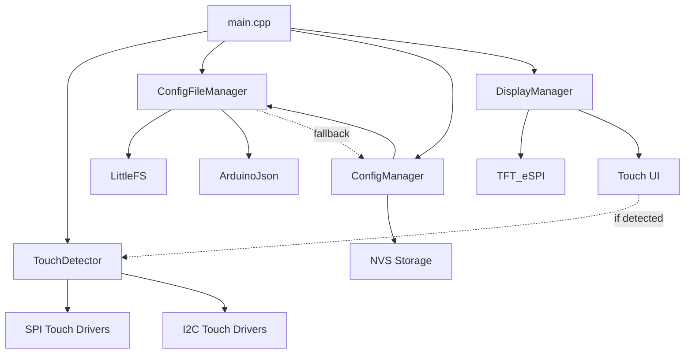
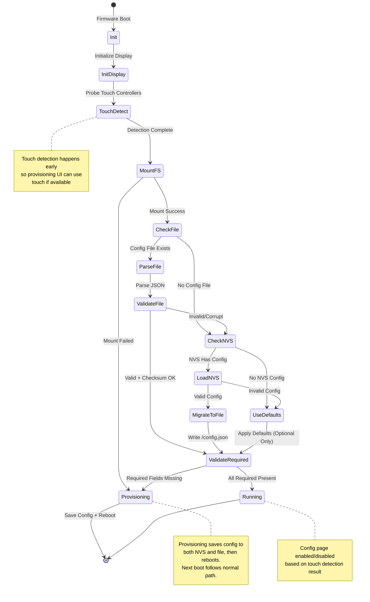

# Design Document: Touch Screen Detection and Configuration File

## Overview

This design implements runtime touch screen detection and a configuration file system for ESP32 firmware. The system adapts to hardware capabilities by detecting touch controllers at boot and providing alternative configuration methods for devices without touch screens.

The design introduces two new components:
- **TouchDetector**: Probes for touch controllers using SPI and I2C protocols
- **ConfigFileManager**: Manages JSON configuration files on LittleFS filesystem

These components integrate with existing ConfigManager and DisplayManager to provide seamless configuration regardless of hardware capabilities.

## Architecture

### Component Diagram




### Boot Sequence State Machine



### Configuration Priority and Required Field Policy

**Boot Source Priority**:
1. `/config.json` (if exists and valid)
2. NVS storage (if config file missing or invalid)
3. Defaults (for optional fields only)

**Required Field Rule**:
- Required fields: `wifi_ssid`, `wifi_password`, `backend_url`
- Defaults NEVER satisfy required fields
- If required fields missing after applying any source: Enter Provisioning Mode
- System SHALL NOT proceed with placeholder defaults for required fields

**Config File Migration Rule**:
- If `/config.json` is missing but NVS has valid config, write `/config.json` (with checksum) on boot
- This makes config file the source of truth going forward
- Migration happens automatically on first boot after firmware update


## Components and Interfaces

### TouchDetector Component

**Purpose**: Detect touch screen capability at runtime by probing supported touch controllers.

**Header**: `firmware/include/TouchDetector.h`

**Interface**:
```cpp
enum class TouchControllerType {
    NONE,
    XPT2046,    // SPI resistive
    FT6236,     // I2C capacitive
    CST816,     // I2C capacitive
    GT911       // I2C capacitive
};

struct TouchDetectionResult {
    bool detected;
    TouchControllerType type;
    uint32_t detectionTimeMs;
};

// Invariant: detected == false if and only if type == TouchControllerType::NONE

class TouchDetector {
public:
    TouchDetector();
    ~TouchDetector();

    // Perform detection sequence (blocking, max 500ms)
    TouchDetectionResult detect();

    // Get last detection result
    TouchDetectionResult getLastResult() const;

private:
    TouchDetectionResult lastResult;

    // Per-controller probe methods (max 150ms each)
    bool probeXPT2046(uint32_t timeoutMs);
    bool probeFT6236(uint32_t timeoutMs);
    bool probeCST816(uint32_t timeoutMs);
    bool probeGT911(uint32_t timeoutMs);

    // Stability verification (requires 2 consecutive successful reads)
    bool verifyStability(TouchControllerType type);
};
```


**Detection Algorithm**:

1. **SPI Controllers** (Priority 1):
   - Probe XPT2046 (resistive touch)
   - Timeout: 150ms per probe
   - Method: Attempt to read controller ID register or generate test touch sample
   - Stability: Require 2 consecutive successful reads

2. **I2C Controllers** (Priority 2):
   - Probe in order: FT6236, CST816, GT911
   - Timeout: 150ms per probe
   - Method: Probe known I2C addresses with read of known ID register (per controller)
   - Known I2C addresses:
     - FT6236: 0x38
     - CST816: 0x15
     - GT911: 0x5D or 0x14 (configurable via INT/RST pins)
   - Treat NACK as "not present" (do NOT scan entire I2C bus)
   - Stability: Require 2 consecutive successful reads

3. **Total Timeout**: 500ms maximum (enforced by watchdog in detect() method)

**Touch Polling Constraints**:
- Polling interval: 50ms
- Polling task MUST NOT block sensor loop
- Polling task MUST yield to other tasks
- Memory cap: Touch driver resources (~8KB) only allocated if touch detected

**Integration Points**:
- Called from `main.cpp` during `setup()` after config loading and validation
- Result stored and passed to ConfigManager and DisplayManager
- No touch driver initialization if detection fails (resource conservation)


### ConfigFileManager Component

**Purpose**: Manage JSON configuration files on LittleFS filesystem with validation and atomic writes.

**Header**: `firmware/include/ConfigFileManager.h`

**Interface**:
```cpp
enum class ConfigLoadResult {
    SUCCESS,                    // File loaded, parsed, checksum OK (may still have missing required fields)
    FILE_NOT_FOUND,            // No config file exists
    PARSE_ERROR,               // JSON parsing failed
    SCHEMA_ERROR,              // schema_version field missing
    CHECKSUM_ERROR,            // Checksum validation failed
    FS_MOUNT_ERROR             // LittleFS mount failed
};

// Separate validation result for required fields
struct ConfigValidationResult {
    bool requiredFieldsPresent;
    String missingFields;  // Comma-separated list of missing required fields
};

struct ConfigFileData {
    // Schema metadata
    uint32_t schemaVersion;
    String checksum;

    // Required fields
    String wifiSsid;
    String wifiPassword;  // May be empty string for open networks
    String backendUrl;

    // Optional fields (with defaults)
    String friendlyName;        // default: "ESP32-Sensor-{hardware_id}"
    uint8_t displayBrightness;  // default: 128 (0-255)
    uint32_t dataUploadInterval; // default: 60 seconds
    uint32_t sensorReadInterval; // default: 10 seconds
    bool enableDeepSleep;       // default: false
};

class ConfigFileManager {
public:
    ConfigFileManager();
    ~ConfigFileManager();

    // Initialize LittleFS
    bool initialize();

    // Load config from /config.json
    ConfigLoadResult loadConfig(ConfigFileData& outConfig);

    // Save config to /config.json (atomic write via temp file)
    bool saveConfig(const ConfigFileData& config);

    // Validate config data
    bool validateConfig(const ConfigFileData& config, String& outError);

    // Check if required fields are present
    ConfigValidationResult checkRequiredFields(const ConfigFileData& config);

    // Get default config
    ConfigFileData getDefaults(const String& hardwareId);

    // Get last error message
    String getLastError() const;

private:
    String lastError;
    bool fsInitialized;

    // CRC32 checksum calculation
    String calculateChecksum(const String& jsonContent);

    // Field validation helpers
    bool validateStringLength(const String& str, uint16_t maxLen);
    bool validateIntegerRange(int32_t value, int32_t min, int32_t max);
    bool validateUrl(const String& url);
};
```


**File Format**:

```json
{
  "schema_version": 1,
  "checksum": "A1B2C3D4",
  "wifi_ssid": "MyNetwork",
  "wifi_password": "SecurePassword123",
  "backend_url": "https://api.example.com/sensors",
  "friendly_name": "Garden Sensor",
  "display_brightness": 200,
  "data_upload_interval": 300,
  "sensor_read_interval": 30,
  "enable_deep_sleep": false
}
```

**Checksum Calculation**:
1. Set `checksum` field to empty string `""`
2. Serialize JSON to minified string with fields in fixed order (canonical form)
3. Calculate CRC32 over UTF-8 bytes
4. Convert to hex string (8 characters)
5. Store in `checksum` field

**Field Order for Canonical Form**:
- schema_version, checksum, wifi_ssid, wifi_password, backend_url, friendly_name, display_brightness, data_upload_interval, sensor_read_interval, enable_deep_sleep

**Note**: Checksum verifies file integrity (corruption/incomplete writes), not semantic equivalence. The save operation always writes fields in the same order to ensure deterministic checksums.

**Atomic Write Sequence**:
1. Write to `/config.tmp`
2. Flush filesystem buffers
3. Rename `/config.tmp` to `/config.json` (atomic operation)
4. If any step fails, keep existing `/config.json` unchanged

**Integration Points**:
- Called from ConfigManager during initialization
- Provides data to populate Config struct
- Saves config when user modifies settings via touch UI


### ConfigManager Integration

**Modified Interface**:
```cpp
class ConfigManager {
public:
    // Existing methods...

    // New: Set touch detection result
    void setTouchDetected(bool detected, TouchControllerType type);

    // New: Load from config file (called before NVS load)
    bool loadFromFile();

    // New: Check if config page should be enabled
    bool isConfigPageEnabled() const;

private:
    bool touchDetected;
    TouchControllerType touchType;
    ConfigFileManager fileManager;
};
```

**Modified Initialization Sequence**:
1. Initialize LittleFS via ConfigFileManager
2. Attempt to load from `/config.json`
   - If successful, populate Config struct
   - If file missing, try NVS
   - If NVS has valid config, migrate to `/config.json`
3. If both file and NVS fail, apply defaults (optional fields only)
4. Validate required fields
5. If required fields missing, enter provisioning mode
6. If all required fields present, proceed to touch detection

**Priority Rules**:
- Boot: Config file > NVS > Defaults (optional only)
- Runtime: Touch UI changes write to both file and NVS
- Config file is source of truth for next boot
- Defaults never satisfy required fields


### DisplayManager Integration

**Modified Interface**:
```cpp
class DisplayManager {
public:
    // Existing methods...

    // New: Enable/disable touch-based config page
    void setTouchEnabled(bool enabled, TouchControllerType type);

    // New: Show config error on display
    void showConfigError(ConfigLoadResult errorType);

private:
    bool touchEnabled;
    TouchControllerType touchType;

    // New: Initialize touch driver (only if enabled)
    bool initializeTouchDriver();

    // New: Poll touch input (only if enabled)
    void pollTouch();
};
```

**Resource Management**:
- Touch driver initialization: Only if `touchEnabled == true`
- Touch polling task: Only created if `touchEnabled == true`
- Touch IRQ handlers: Only attached if `touchEnabled == true`
- Memory savings: ~8KB RAM when touch disabled

### Provisioning Mode Behavior

**Entry Conditions**:
- Required fields missing from config file
- Config file checksum validation fails
- LittleFS mount fails
- User explicitly requests via serial command

**Provisioning Behavior**:
- Display "Provisioning Mode" on TFT
- Serial console configuration always enabled
- If touch detected (during early boot), Config_Page is also enabled for provisioning
- Required fields must be satisfied before normal operation
- Do NOT attempt normal operation with placeholder defaults
- Save configuration to both NVS and config file after completion
- Reboot after successful configuration

## Data Models

### ConfigFileData Structure

Extends existing `Config` struct with file-specific metadata:

```cpp
struct ConfigFileData {
    uint32_t schemaVersion;  // Current: 1
    String checksum;         // CRC32 hex string

    // Maps to Config struct fields
    String wifiSsid;         // Config.wifiSsid
    String wifiPassword;     // Config.wifiPassword (may be empty)
    String backendUrl;       // Config.apiEndpoint
    String friendlyName;     // Config.deviceId
    uint8_t displayBrightness;   // New field
    uint32_t dataUploadInterval; // Derived from Config.publishIntervalSamples
    uint32_t sensorReadInterval; // Config.readingIntervalMs / 1000
    bool enableDeepSleep;        // Config.batteryMode
};
```


### Field Validation Rules

**String Fields**:
- Maximum length: 128 characters
- UTF-8 encoding
- No null bytes
- **Validation behavior for optional fields**: Trim to 128 characters if exceeded, log warning with field name and original length
- **Validation behavior for required fields**: Reject if exceeded, enter provisioning mode, log error with field name and original length

**Integer Fields**:
- `displayBrightness`: 0-255
- `dataUploadInterval`: 10-86400 seconds (10s to 24h)
- `sensorReadInterval`: 1-3600 seconds (1s to 1h)
- `schemaVersion`: See schema version policy below
- **Validation behavior for optional fields**: Clamp to valid range if out of bounds, log warning with field name, original value, and clamped value
- **Validation behavior for required fields**: Reject if out of bounds, enter provisioning mode, log error with field name and original value

**URL Validation**:
- Must start with `http://` or `https://`
- Maximum length: 128 characters
- Must contain valid hostname
- **Validation behavior**: Reject invalid URLs, enter provisioning mode (required field)

**Required Fields**:
- `wifi_ssid`: Must be non-empty string
- `wifi_password`: Required field, may be empty string (for open networks)
- `backend_url`: Must be valid URL

**Optional Fields with Defaults**:
- `friendly_name`: Default = `"ESP32-Sensor-{hardware_id}"`
- `display_brightness`: Default = 128
- `data_upload_interval`: Default = 60
- `sensor_read_interval`: Default = 10
- `enable_deep_sleep`: Default = false

**Schema Version Policy**:
- If `schema_version` is missing: Treat as schema_error
- If `schema_version` > current (1): Allow parse of known fields, ignore unknown fields, log "schema_newer" warning
- If `schema_version` < current (1): Allow parse, log "schema_old" warning
- If `schema_version` == current (1): Normal parsing


## Correctness Properties

*A property is a characteristic or behavior that should hold true across all valid executions of a system—essentially, a formal statement about what the system should do. Properties serve as the bridge between human-readable specifications and machine-verifiable correctness guarantees.*

### Touch Detection Properties

**Property 1: Detection Priority Order**
*For any* detection sequence, SPI controllers (XPT2046) SHALL be probed before I2C controllers (FT6236, CST816, GT911).
**Validates: Requirements 1.1**

**Property 2: Per-Probe Timeout Enforcement**
*For any* controller probe operation, the execution time SHALL NOT exceed 150ms.
**Validates: Requirements 1.2**

**Property 3: Detection Criteria**
*For any* controller probe, detection SHALL be reported as successful only if the probe produces either a stable controller identity read OR at least one valid touch sample.
**Validates: Requirements 1.3**

**Property 4: Total Detection Timeout**
*For any* complete detection sequence, the total execution time SHALL NOT exceed 500ms.
**Validates: Requirements 1.4**

**Property 5: Detection Stability**
*For any* controller type, positive detection SHALL be reported only after two consecutive successful identity or sample reads.
**Validates: Requirements 1.5**

**Property 6: Config Page State Consistency**
*For any* touch detection result, the config page enabled state SHALL match the detection result (enabled if detected, disabled if not detected).
**Validates: Requirements 2.1, 2.2**

**Property 7: Resource Conservation**
*For any* system state where the config page is disabled, no touch driver SHALL be initialized, no touch polling task SHALL be running, and no touch IRQ handlers SHALL be attached.
**Validates: Requirements 2.3**


### Configuration File Properties

**Property 8: Config File Loading**
*For any* valid config file that exists at boot (parseable JSON with valid checksum), the firmware SHALL parse and load the configuration settings from that file.
**Validates: Requirements 3.2**

**Property 9: Invalid Config Handling with Defaults**
*For any* config file containing invalid data in optional fields, the firmware SHALL use default settings for those optional fields and log an appropriate error.
**Validates: Requirements 3.3, 7.2**

**Property 10: Required Field Validation and Provisioning**
*For any* config file, if any required field (wifi_ssid, wifi_password, backend_url) is missing or invalid, the firmware SHALL treat the file as invalid and enter provisioning mode without using placeholder defaults.
**Validates: Requirements 3.5, 3.6**

**Property 11: Checksum Validation**
*For any* config file with a checksum field, the firmware SHALL compute CRC32 over the canonical serialized JSON (with checksum field set to empty string, fixed field order, minified format) and reject the file if the computed checksum does not match the stored checksum.
**Validates: Requirements 4.2, 4.6**

**Property 12: Field Type and Range Validation**
*For any* config file field, the firmware SHALL validate that the field type matches the expected type and that numeric values fall within specified ranges, applying appropriate handling based on whether the field is required or optional.
**Validates: Requirements 4.3**

**Property 13: Validation Error Messages**
*For any* config file validation failure, the firmware SHALL provide a descriptive error message indicating the specific validation failure.
**Validates: Requirements 4.4**

**Property 14: Configuration Priority**
*For any* boot sequence where both touch capability exists and a valid config file is present, the firmware SHALL load settings from the config file rather than NVS or defaults.
**Validates: Requirements 5.1**

**Property 15: Atomic Config Save**
*For any* config save operation via the config page, the firmware SHALL write to a temporary file, flush the filesystem, then atomically rename to /config.json, ensuring the prior config remains unchanged if any step fails.
**Validates: Requirements 5.3, 5.4**


**Property 16: Configuration Coverage Parity**
*For any* setting available in the config page, there SHALL exist a corresponding field in the config file format.
**Validates: Requirements 6.1, 6.2, 6.3**

**Property 17: Forward Compatibility**
*For any* config file containing unknown fields not in the current schema, the firmware SHALL ignore those fields without error and continue loading known fields.
**Validates: Requirements 6.5**

**Property 18: Optional Field Defaults**
*For any* optional field that is missing from a config file, the firmware SHALL use the predefined default value for that field.
**Validates: Requirements 6.6, 7.1**

**Property 19: Touch Detection Fallback**
*For any* boot sequence where touch detection fails, the firmware SHALL proceed with config file loading without attempting to initialize touch drivers.
**Validates: Requirements 7.3**

**Property 20: Config Error Display**
*For any* configuration loading failure, the firmware SHALL display a one-line status message on the TFT display indicating the specific failure type (missing, parse_error, schema_error, checksum_error, or fs_mount_error).
**Validates: Requirements 7.4**

### Field Validation Properties

**Property 21: String Length Validation**
*For any* string field in a config file, the firmware SHALL reject required fields exceeding 128 characters (entering provisioning mode) and trim optional fields to 128 characters with a logged warning.
**Validates: Requirements 8.3**

**Property 22: Integer Range Validation**
*For any* integer field in a config file, the firmware SHALL validate that the value falls within the specified range for that field, rejecting required fields that are out of range (entering provisioning mode) and clamping optional fields with a logged warning.
**Validates: Requirements 8.4**

**Property 23: URL Format Validation**
*For any* backend_url field value, the firmware SHALL validate that it begins with either "http://" or "https://" and reject other URL schemes, entering provisioning mode.
**Validates: Requirements 8.5**

**Property 24: Deep Sleep Trigger**
*For any* system state where enable_deep_sleep is true in the config, the firmware SHALL enter deep sleep mode after each successful data upload cycle completes.
**Validates: Requirements 8.6**

**Property 25: Config Persistence Round-Trip**
*For any* valid config written by the firmware, reading that config on the next boot SHALL succeed and pass checksum verification, producing an equivalent configuration.
**Validates: System reliability and data integrity**


## Error Handling

### Touch Detection Errors

**Timeout Handling**:
- Per-probe timeout: 150ms enforced by timer
- Total timeout: 500ms enforced by watchdog
- On timeout: Mark controller as not detected, continue to next probe
- Log: Warning level with controller type and timeout duration

**Communication Errors**:
- SPI errors: Log and continue to I2C probes
- I2C errors: Try next I2C address/controller
- No controllers found: Not an error, proceed with config file only

### Configuration File Errors

**File System Errors**:
- LittleFS mount failure: Log critical error, enter provisioning mode
- File not found: Not an error, try NVS then defaults for optional fields
- Read error: Log error, try NVS then defaults for optional fields
- Write error: Keep existing config, display error to user

**Parse Errors**:
- Invalid JSON: Log parse error with line/column, try NVS then defaults
- Missing required field: Log error, enter provisioning mode
- Invalid field type (optional): Log error with field name, use default for that field
- Invalid field type (required): Log error, enter provisioning mode
- Invalid field value (optional): Log error with field name and value, clamp/trim and log warning
- Invalid field value (required): Log error, enter provisioning mode

**Validation Errors**:
- Checksum mismatch: Log error, treat file as corrupt, enter provisioning mode
- Schema version missing: Log error, treat as schema_error
- Schema version > current: Log "schema_newer" warning, parse known fields, ignore unknown
- Schema version < current: Log "schema_old" warning, parse normally
- String too long (optional): Log warning, trim to 128 characters
- String too long (required): Log error, enter provisioning mode
- Integer out of range (optional): Log warning, clamp to valid range
- Integer out of range (required): Log error, enter provisioning mode
- Invalid URL format: Log error, enter provisioning mode (required field)


**Error Display**:
```cpp
void DisplayManager::showConfigError(ConfigLoadResult errorType) {
    String message;
    switch (errorType) {
        case FILE_NOT_FOUND:
            message = "Config: file missing";
            break;
        case PARSE_ERROR:
            message = "Config: Parse error";
            break;
        case SCHEMA_ERROR:
            message = "Config: Schema error";
            break;
        case CHECKSUM_ERROR:
            message = "Config: Checksum error";
            break;
        case FS_MOUNT_ERROR:
            message = "Config: FS mount failed";
            break;
    }
    // Display one-line message at bottom of screen
    drawText(0, screenHeight - 16, message, TFT_YELLOW, 1);
}
```

## Testing Strategy

### Dual Testing Approach

This feature requires both unit tests and property-based tests for comprehensive coverage:

**Unit Tests**: Focus on specific examples, edge cases, and integration points
- Touch controller probe sequences with mocked hardware
- Config file parsing with specific JSON examples
- Error handling for specific failure scenarios
- Integration between components

**Property-Based Tests**: Verify universal properties across all inputs
- Touch detection timing constraints across random probe sequences
- Config file validation across randomly generated configurations
- Checksum calculation and verification across random file contents
- Field validation across random input values

Both testing approaches are complementary and necessary. Unit tests catch concrete bugs in specific scenarios, while property tests verify general correctness across the input space.


### Property-Based Testing Configuration

**Testing Library**: [RapidCheck](https://github.com/emil-e/rapidcheck) for C++
- Mature property-based testing library for C++
- Integrates with existing test framework
- Supports custom generators for ESP32 types

**Test Configuration**:
- Minimum 100 iterations per property test
- Each test tagged with feature name and property number
- Tag format: `Feature: touch-screen-detection-and-config-file, Property N: [property text]`

**Example Property Test Structure**:
```cpp
// Feature: touch-screen-detection-and-config-file, Property 2: Per-Probe Timeout Enforcement
TEST_CASE("Touch probe timeout enforcement") {
    rc::check("probe duration never exceeds 150ms", []() {
        // Note: Probe methods are private; unit tests validate via mocks and detect()
        MockTouchHardware mockHardware;
        TouchDetector detector;

        auto startTime = millis();
        auto result = detector.detect();
        auto duration = millis() - startTime;

        // Verify total detection time
        RC_ASSERT(duration <= 500);

        // Verify individual probe times via mock verification
        RC_ASSERT(mockHardware.getMaxProbeTime() <= 150);
    });
}
```

**Note on Testing Private Methods**: Probe methods (probeXPT2046, probeFT6236, etc.) are private. Unit tests validate timing constraints through the public detect() method using mocked hardware interfaces.

### Unit Testing Focus Areas

**Touch Detection**:
- Mock SPI/I2C communication
- Test probe order (SPI before I2C)
- Test stability verification (2 consecutive reads)
- Test timeout enforcement
- Test detection result caching

**Config File Management**:
- Test JSON parsing with valid files
- Test checksum calculation and verification
- Test atomic write sequence
- Test error handling for corrupt files
- Test default value application
- Test required vs optional field validation

**Integration**:
- Test ConfigManager initialization with file loading
- Test NVS to file migration
- Test DisplayManager touch enable/disable
- Test provisioning mode entry
- Test config priority (file > NVS > defaults)


### Test Data Generators

**For Property-Based Tests**:

```cpp
// Generate random touch controller types
namespace rc {
    template<>
    struct Arbitrary<TouchControllerType> {
        static Gen<TouchControllerType> arbitrary() {
            return gen::element(
                TouchControllerType::NONE,
                TouchControllerType::XPT2046,
                TouchControllerType::FT6236,
                TouchControllerType::CST816,
                TouchControllerType::GT911
            );
        }
    };
}

// Generate random config file data
Gen<ConfigFileData> genConfigFileData() {
    return gen::build<ConfigFileData>(
        gen::set(&ConfigFileData::schemaVersion, gen::inRange(1, 10)),
        gen::set(&ConfigFileData::wifiSsid, gen::string<String>()),
        gen::set(&ConfigFileData::wifiPassword, gen::string<String>()),
        gen::set(&ConfigFileData::backendUrl, genUrl()),
        gen::set(&ConfigFileData::displayBrightness, gen::inRange(0, 255)),
        gen::set(&ConfigFileData::dataUploadInterval, gen::inRange(10, 86400)),
        gen::set(&ConfigFileData::sensorReadInterval, gen::inRange(1, 3600)),
        gen::set(&ConfigFileData::enableDeepSleep, gen::arbitrary<bool>())
    );
}

// Generate random valid URLs
Gen<String> genUrl() {
    return gen::map(
        gen::pair(
            gen::element("http://", "https://"),
            gen::string<String>()
        ),
        [](const auto& pair) {
            return pair.first + "example.com/" + pair.second;
        }
    );
}
```

## Implementation Notes

### Dependencies

**New Libraries Required**:
- `ArduinoJson` (v6.x): JSON parsing and serialization
- `LittleFS`: Filesystem for ESP32 (built into ESP32 Arduino core)
- `RapidCheck`: Property-based testing library (test only)

**Existing Libraries Used**:
- `TFT_eSPI`: Display driver (already in use)
- `Wire`: I2C communication (already in use)
- `SPI`: SPI communication (already in use)
- `Preferences`: NVS storage (already in use)


### Memory Considerations

**Flash Usage**:
- TouchDetector: ~4KB code
- ConfigFileManager: ~6KB code
- ArduinoJson library: ~20KB code
- Total additional flash: ~30KB

**RAM Usage**:
- TouchDetector: ~200 bytes (detection result + state)
- ConfigFileManager: ~1KB (JSON document buffer)
- ConfigFileData: ~600 bytes (strings + metadata)
- Touch driver (when enabled): ~8KB
- Total additional RAM: ~2KB (touch disabled) or ~10KB (touch enabled)

**LittleFS Partition**:
- Minimum size: 64KB
- Recommended size: 128KB
- Config file size: ~500 bytes
- Allows for future expansion (logs, certificates, etc.)

### Performance Considerations

**Boot Time Impact**:
- LittleFS mount: 10-50ms
- Config file load: 10-50ms (depends on file size)
- Touch detection: 100-500ms (depends on hardware)
- Total additional boot time: 120-600ms
- Acceptable for sensor device use case

**Runtime Impact**:
- Config file operations: Only during save (infrequent)
- Touch polling: 50ms interval (only if touch enabled)
- No impact on sensor reading or data transmission loops

### Security Considerations

**Config File Security**:
- Contains WiFi credentials (sensitive)
- Stored in plaintext on LittleFS
- Physical access to device = access to credentials
- Mitigation: Use WPA3, rotate credentials regularly
- Future enhancement: Encrypt config file with device-specific key


**Checksum Security**:
- CRC32 detects accidental corruption, not malicious tampering
- Not cryptographically secure
- Sufficient for detecting filesystem corruption or incomplete writes
- Future enhancement: Use HMAC-SHA256 for tamper detection

### Backward Compatibility

**Existing Devices**:
- Config file is optional (backward compatible)
- Existing NVS-based config continues to work
- Migration path: First boot loads from NVS, saves to file
- No breaking changes to existing ConfigManager API

**Schema Versioning**:
- Current schema version: 1
- Future versions: Increment schema_version field
- Parser handles newer schemas (forward compatibility via unknown field ignoring)
- Parser handles older schemas (backward compatibility via default values)

### Future Enhancements

**Potential Additions**:
1. **Config file encryption**: Protect sensitive credentials
2. **Remote config updates**: Download config from backend
3. **Multiple config profiles**: Switch between configurations
4. **Config validation API**: Web endpoint to validate config before upload
5. **Touch calibration storage**: Save calibration data to config file
6. **Gesture support**: Add gesture recognition for touch controllers
7. **Config backup/restore**: Export/import config via serial or web

**Schema Evolution**:
- Add fields without breaking existing parsers (optional fields)
- Deprecate fields gradually (keep parsing, ignore values)
- Major version bump for breaking changes (schema_version: 2)

## References

**Touch Controller Documentation**:
- [XPT2046 Datasheet](https://www.buydisplay.com/download/ic/XPT2046.pdf) - SPI resistive touch controller
- [FT6236 Datasheet](https://www.displayfuture.com/Display/datasheet/controller/FT6236.pdf) - I2C capacitive touch controller
- [CST816 Datasheet](https://github.com/espressif/esp-bsp/blob/master/components/lcd_touch/esp_lcd_touch_cst816s/datasheet/CST816S_Datasheet_EN.pdf) - I2C capacitive touch controller
- [GT911 Datasheet](https://www.waveshare.com/w/upload/5/51/GT911_Datasheet.pdf) - I2C capacitive touch controller

**ESP32 Resources**:
- [LittleFS Documentation](https://docs.espressif.com/projects/esp-idf/en/latest/esp32/api-reference/storage/littlefs.html) - ESP32 filesystem
- [ArduinoJson Documentation](https://arduinojson.org/) - JSON library for embedded systems
- [ESP32 I2C Documentation](https://docs.espressif.com/projects/esp-idf/en/latest/esp32/api-reference/peripherals/i2c.html) - I2C communication
- [ESP32 SPI Documentation](https://docs.espressif.com/projects/esp-idf/en/latest/esp32/api-reference/peripherals/spi_master.html) - SPI communication

Content was rephrased for compliance with licensing restrictions.
